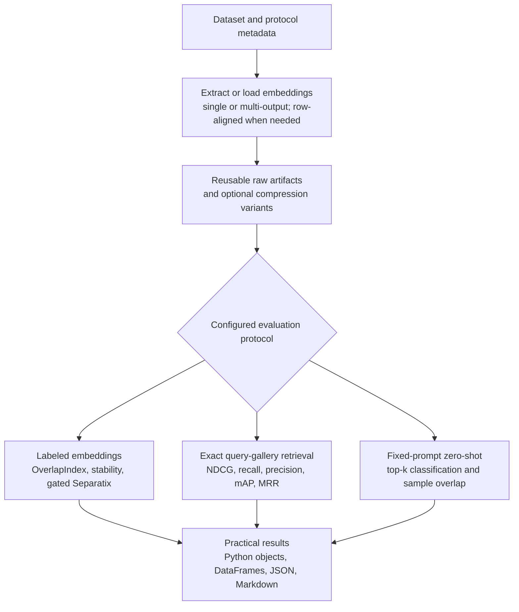
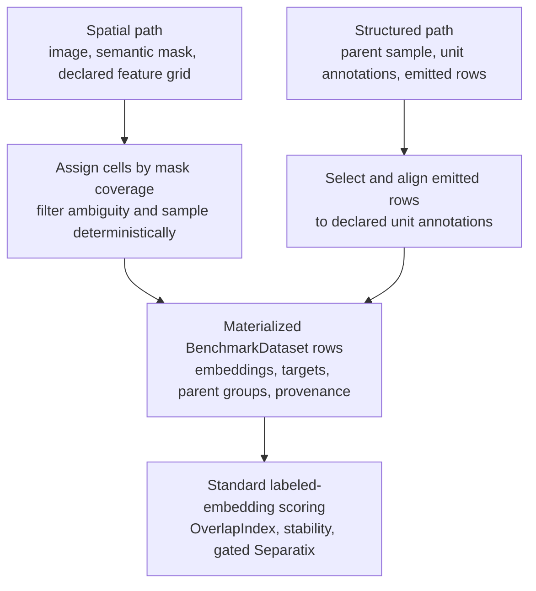

# Vertebrae

<p align="center">
  <a href="https://github.com/NiklasMelton/vertebrae">
    
  </a>
</p>

`vertebrae` is a Python package for evaluating feature extractors and
transfer-learning backbones on labeled datasets. It supports dense and sparse
precomputed embeddings, scikit-learn pipelines, custom callable extractors, ONNX
models, local PyTorch and Keras modules, segmentation token workflows, optional
embedding compression, and optional model families spanning Hugging Face,
sentence-transformers, timm, torchvision, OpenCLIP/SigLIP, TensorFlow Hub,
JAX/Flax, tree ensembles, graph models, and hosted embedding APIs. It can also
evaluate labeled embedding units such as document regions, tokens, frames,
keypoints, depth cells, and latent slots emitted directly by a model.

The package uses [OverlapIndex](https://github.com/NiklasMelton/OverlapIndex) as
its primary separation metric and adds a
[Separatix](https://github.com/NiklasMelton/Separatix) complexity diagnostic to
reports when an evaluated embedding
clears a configurable overlap-quality threshold. The full evaluation flow wraps
those diagnostics with practical dataset handling, named target and hierarchy
views, caching, memory-aware subsampling, stability analysis, artifact-backed
execution, custom embedding metrics, report generation, and repeated monitoring
of live representations during training.

SciPy sparse matrices and sparse arrays are normalized to CSR and remain sparse
through classification, multi-label, regression, and stability scoring, and when
passed into Separatix. Multi-label targets may also be supplied as sparse binary
indicator matrices.

## Evaluation flow

The benchmark protocols share extraction, artifact, compression, and reporting
infrastructure while keeping their scoring semantics separate.



## Installation

```bash
pip install vertebrae
```

For local development:

```bash
poetry install --with dev
```

Optional Hugging Face and sentence-transformers support:

```bash
pip install "vertebrae[hf]"
```

Optional Hugging Face audio support only:

```bash
pip install "vertebrae[audio]"
```

Optional Hugging Face time-series support only:

```bash
pip install "vertebrae[timeseries]"
```

Optional Hugging Face video support only:

```bash
pip install "vertebrae[video]"
```

Optional local PyTorch model support:

```bash
pip install "vertebrae[torch]"
pip install "vertebrae[timm]"
pip install "vertebrae[torchvision]"
pip install "vertebrae[openclip]"
```

Optional dependencies for the Fashion-MNIST visual example suite:

```bash
pip install "vertebrae[visuals]"
```

Optional dependencies for the Tiny Shakespeare transformer visual suite:

```bash
pip install "vertebrae[text-visuals]"
```

Optional local Keras model support:

```bash
pip install "vertebrae[keras]"
pip install "vertebrae[tensorflow]"
pip install "vertebrae[tensorflow-hub]"
```

Optional ONNX Runtime support:

```bash
pip install "vertebrae[onnx]"
```

Optional JAX/Flax, tree ensemble, and graph model support:

```bash
pip install "vertebrae[jax]"
pip install "vertebrae[trees]"
pip install "vertebrae[graph]"
```

Optional distributed execution backends:

```bash
pip install "vertebrae[ray]"
pip install "vertebrae[dask]"
pip install "vertebrae[distributed]"
```

Optional cloud artifact stores:

```bash
pip install "vertebrae[s3]"
pip install "vertebrae[gcs]"
pip install "vertebrae[cloud]"
```

## Quick Start

### Precomputed embeddings

```python
from vertebrae import BenchmarkDataset, Evaluator, DatasetIdentity
from vertebrae.extractors import PrecomputedExtractor

dataset = BenchmarkDataset.from_embeddings(embeddings=Z, labels=y, identity=DatasetIdentity.declared("example-dataset", "1"))
extractor = PrecomputedExtractor(name="baseline_embeddings")

result = Evaluator(dataset=dataset, extractor=extractor).run()

print(result.to_dataframe())
result.save_json("result.json")
result.save_markdown("report.md")
```

Every root dataset requires an explicit `DatasetIdentity`. A declared identity is the
recommended production choice; change its revision whenever the dataset content,
ordering, targets, groups, or annotations change. Manifest identity hashes only a
caller-provided source manifest. Full content hashing and ephemeral UUID identity are
available only through the explicit `DatasetIdentity.from_content()` and
`DatasetIdentity.ephemeral()` constructors. Path-based datasets are never scanned or
hashed automatically. See [Dataset identity](https://github.com/NiklasMelton/vertebrae/blob/develop/docs/datasets.md#dataset-identity).

Sparse matrices are supported as embedding inputs as well.

By default, vertebrae also runs a Separatix complexity diagnostic when the
evaluated embedding reaches `overlap_macro >= 0.80`. That extra diagnostic does
not affect ranking. It adds report guidance about what kind of downstream
classifier complexity the labeled geometry appears to need.

Multi-label classification datasets are supported through the same constructors.
Use per-sample label sequences or a binary indicator matrix with `label_names`:

```python
from vertebrae import DatasetIdentity
dataset = BenchmarkDataset.from_embeddings(
    embeddings=Z,
    labels=[
        ("outdoor", "vehicle"),
        ("outdoor", "vehicle"),
        ("indoor",),
        ("indoor",),
        ("outdoor", "animal"),
        ("animal",),
    ],
    identity=DatasetIdentity.declared("example-dataset", "1"),
)

result = Evaluator(dataset=dataset, extractor=PrecomputedExtractor()).run()
```

OverlapIndex receives a dense multi-label indicator target internally, and
Separatix runs with `target_mode="multilabel"`.

Regression targets are supported when explicitly requested so numeric class
identifiers are not accidentally interpreted as continuous targets:

```python
from vertebrae import DatasetIdentity
dataset = BenchmarkDataset.from_arrays(
    X=samples,
    y=targets,
    modality="tabular",
    target_type="regression",
    target_names=["quality_score"],
    identity=DatasetIdentity.declared("example-dataset", "1"),
)

result = Evaluator(dataset=dataset, extractor=extractor).run()
```

Regression scoring uses `ContinuousOverlapIndex` through vertebrae's internal
scoring adapter and appears in reports as continuous overlap diagnostics.

### Multiple target views

When one embedding should be compared against several aligned targets, register
named target views on the dataset and enable them in `Benchmark`. Views can be
classification, multi-label, or regression targets; each is reported as a
separate result variant.

```python
from vertebrae import Benchmark, BenchmarkDataset, TargetView, TargetViewConfig, DatasetIdentity

dataset = BenchmarkDataset.from_embeddings(embeddings=Z, labels=leaf_labels, identity=DatasetIdentity.declared("example-dataset", "1"))
dataset = dataset.with_target_views(
    [
        TargetView(name="coarse", targets=coarse_labels),
        TargetView(name="quality", targets=quality_scores, target_type="regression"),
    ]
)

result = Benchmark(
    dataset,
    [extractor],
    target_view_config=TargetViewConfig(enabled=True, views=("coarse", "quality")),
).run()
```

For taxonomies represented as label paths, use `with_label_hierarchy(...)` and
`LabelViewConfig` instead. `output_views` and `output_levels` can route named
extractor outputs to the target or hierarchy view that they should evaluate.

Classification labels keep exact typed semantic identity in the dataset and label
catalog. For example, integer `1` and string `"1"` are separate classes even though
their ordinary string forms match. Metric adapters receive marked semantic-key strings
in both local and artifact-backed runs, while results retain the original typed values,
stable internal keys, and disambiguated display text in the catalog. Hierarchy paths
are encoded structurally rather than by joining values with a delimiter.

### Optional embedding compression

```python
from vertebrae import BenchmarkDataset, EmbeddingCompressionConfig, Evaluator, DatasetIdentity
from vertebrae.extractors import PrecomputedExtractor

dataset = BenchmarkDataset.from_embeddings(embeddings=Z, labels=y, identity=DatasetIdentity.declared("example-dataset", "1"))
extractor = PrecomputedExtractor(name="baseline_embeddings")

compression = EmbeddingCompressionConfig(
    enabled=True,
    method="prefix_truncate",
    n_components=256,
    assume_matryoshka=True,
)

result = Evaluator(
    dataset=dataset,
    extractor=extractor,
    compression_config=compression,
).run()
```

Supported compression methods include `pca`, `incremental_pca`,
`truncated_svd`, random projections, `prefix_truncate`, and `quantize`.

The network-free-after-download
[`fashion_mnist_visual_suite.py`](https://github.com/NiklasMelton/vertebrae/blob/develop/examples/fashion_mnist_visual_suite.py)
also illustrates the storage-quality tradeoffs of PCA and quantization on a
trained penultimate embedding. Each point shows the measured OverlapIndex score
against encoded bytes per sample; the dashed line marks the non-dominated frontier.


### Scikit-learn pipelines

```python
from sklearn.decomposition import TruncatedSVD
from sklearn.feature_extraction.text import TfidfVectorizer
from sklearn.pipeline import Pipeline
from sklearn.preprocessing import Normalizer

from vertebrae import BenchmarkDataset, Evaluator, DatasetIdentity
from vertebrae.extractors import SklearnExtractor

pipeline = Pipeline(
    [
        ("tfidf", TfidfVectorizer(ngram_range=(1, 2), min_df=2)),
        ("svd", TruncatedSVD(n_components=128, random_state=42)),
        ("norm", Normalizer()),
    ]
)

dataset = BenchmarkDataset.from_arrays(texts, labels, modality="text", identity=DatasetIdentity.declared("example-dataset", "1"))
extractor = SklearnExtractor(
    name="tfidf_svd",
    pipeline=pipeline,
    # This manually versioned identity opts the fitted live pipeline into reuse.
    cache_identity="tfidf-svd-v1",
)

result = Evaluator(dataset=dataset, extractor=extractor).run()
```

### Local PyTorch models

```python
import numpy as np
import torch

from vertebrae import BenchmarkDataset, Evaluator, DatasetIdentity
from vertebrae.extractors import TorchExtractor

model = torch.load("/path/to/local_model.pt", map_location="cpu")
model.eval()


def collate_fn(batch):
    return torch.as_tensor(np.asarray(batch), dtype=torch.float32)


def output_fn(raw_output):
    return raw_output if isinstance(raw_output, torch.Tensor) else raw_output["embeddings"]


dataset = BenchmarkDataset.from_arrays(features, labels, modality="tabular", identity=DatasetIdentity.declared("example-dataset", "1"))
extractor = TorchExtractor(
    name="local_torch",
    model=model,
    collate_fn=collate_fn,
    output_fn=output_fn,
    device="cpu",
    checkpoint_paths=["/path/to/local_model.pt"],
    cache_identity="local-torch-model-v1",
    recipe_data={"checkpoint": "/path/to/local_model.pt"},
)

result = Evaluator(dataset=dataset, extractor=extractor).run()
```

### Local Keras models

```python
import numpy as np

from vertebrae import BenchmarkDataset, Evaluator, DatasetIdentity
from vertebrae.extractors import KerasExtractor


def collate_fn(batch):
    return np.asarray(batch, dtype=np.float32)


dataset = BenchmarkDataset.from_arrays(features, labels, modality="tabular", identity=DatasetIdentity.declared("example-dataset", "1"))
extractor = KerasExtractor(
    name="local_keras",
    model=model,
    collate_fn=collate_fn,
    call_method="call",
    checkpoint_paths=["/path/to/model.keras"],
    cache_identity="local-keras-model-v1",
    recipe_data={"checkpoint": "/path/to/model.keras"},
)

result = Evaluator(dataset=dataset, extractor=extractor).run()
```

`checkpoint_paths` contributes content-digested provenance and profiling evidence; a
path copied only into `recipe_data` is descriptive metadata. Because these adapters
receive already-loaded live model objects, the path cannot prove that the in-memory
weights match the file, so reusable caching still requires a maintained
`cache_identity`. Torch extraction defaults to evaluation plus inference mode and
restores the model's prior training state afterward. Notebook-local, nested, or
otherwise nonportable adapter functions likewise require an explicit identity.

### Hugging Face audio backbones

```python
from vertebrae import BenchmarkDataset, CacheConfig, Evaluator, DatasetIdentity
from vertebrae.extractors import HFAudioExtractor

dataset = BenchmarkDataset.from_audio_arrays(
    audio=waveforms,
    labels=labels,
    sampling_rate=16_000,
    identity=DatasetIdentity.declared("example-dataset", "1"),
)
extractor = HFAudioExtractor(
    name="wav2vec2_base",
    model_id="facebook/wav2vec2-base",
    pooling="mean",
)

# This introductory model ID is intentionally unpinned, so do not reuse its output.
result = Evaluator(
    dataset=dataset,
    extractor=extractor,
    cache_config=CacheConfig(enabled=False),
).run()
```

### Hugging Face multi-modal models

```python
from vertebrae import BenchmarkDataset, CacheConfig, Evaluator, DatasetIdentity
from vertebrae.extractors import HFMultimodalExtractor

dataset = BenchmarkDataset.from_multimodal(
    inputs={"image": images, "caption": captions},
    labels=labels,
    modalities={"image": "image", "caption": "text"},
    identity=DatasetIdentity.declared("example-dataset", "1"),
)

extractor = HFMultimodalExtractor(
    name="clip_like",
    model_id="openai/clip-vit-base-patch32",
    input_modalities={"image": "image", "caption": "text"},
    outputs=[
        {"name": "image_branch", "source": "image", "model_output": "image_embeds"},
        {"name": "text_branch", "source": "text", "model_output": "text_embeds"},
        {"name": "fused", "source": "fused", "model_output": "pooler_output"},
    ],
)

# This introductory model ID is intentionally unpinned, so do not reuse its output.
result = Evaluator(
    dataset=dataset,
    extractor=extractor,
    cache_config=CacheConfig(enabled=False),
).run()
```

### Hugging Face time-series backbones

```python
from vertebrae import BenchmarkDataset, CacheConfig, Evaluator, DatasetIdentity
from vertebrae.extractors import HFTimeSeriesExtractor

dataset = BenchmarkDataset.from_time_series(
    series=series,
    labels=labels,
    identity=DatasetIdentity.declared("example-dataset", "1"),
)
extractor = HFTimeSeriesExtractor(
    name="patchtst",
    model_id="some-local-or-hf-timeseries-model",
    pooling="mean",
)

# This placeholder may resolve to mutable remote state.
result = Evaluator(
    dataset=dataset,
    extractor=extractor,
    cache_config=CacheConfig(enabled=False),
).run()
```

### Hugging Face video backbones

```python
from vertebrae import BenchmarkDataset, CacheConfig, Evaluator, DatasetIdentity
from vertebrae.extractors import HFVideoExtractor

dataset = BenchmarkDataset.from_video_arrays(
    frames=clips,
    labels=labels,
    frame_rate=24.0,
    identity=DatasetIdentity.declared("example-dataset", "1"),
)
extractor = HFVideoExtractor(
    name="videomae_base",
    model_id="MCG-NJU/videomae-base",
    pooling="mean",
    num_frames=16,
)

# This introductory model ID is intentionally unpinned, so do not reuse its output.
result = Evaluator(
    dataset=dataset,
    extractor=extractor,
    cache_config=CacheConfig(enabled=False),
).run()
```

### Multi-extractor comparison

```python
from vertebrae import Benchmark

benchmark = Benchmark(dataset)
benchmark.add_extractor(tfidf_extractor)
benchmark.add_extractor(sentence_transformer_extractor)
benchmark.add_extractor(custom_extractor)

result = benchmark.run()
print(result.to_dataframe())
```

You can also benchmark multiple embedding outputs from the same backbone without
duplicating extractor classes. This is useful for comparing intermediate layers,
pooling strategies, or multi-head outputs from one model. When the dataset has
hierarchy metadata from `with_label_hierarchy(...)`, outputs can be routed to
different hierarchy levels:

```python
from vertebrae import Benchmark, CacheConfig, LabelViewConfig
from vertebrae.extractors import HFVisionExtractor

benchmark = Benchmark(
    dataset,
    label_view_config=LabelViewConfig(
        output_levels={
            "mid_cls": "family",
            "final_cls": "leaf",
        },
    ),
    # The example model IDs below are intentionally unpinned.
    cache_config=CacheConfig(enabled=False),
)
benchmark.add_extractor(
    HFVisionExtractor(
        name="mnist_vit",
        model_id="farleyknight-org-username/vit-base-mnist",
        outputs=[
            {"name": "final_cls", "pooling": "cls"},
            {"name": "mid_cls", "pooling": "cls", "hidden_layer": 6},
        ],
        image_mode="rgb",
        batch_size=8,
    )
)

result = benchmark.run()
print(result.to_dataframe()[["extractor", "label_view", "overlap_macro"]])
```

Each configured output is scored as its own result variant, so this run produces
rows such as `mnist_vit:mid_cls[level=family]` and
`mnist_vit:final_cls[level=leaf]`. See `examples/hf_vision_mnist.py` for a fuller
example that compares multi-output Hugging Face vision embeddings alongside a
classical scikit-learn image baseline.
For a more realistic image workflow, `examples/caltech101_vision_foundation_models.py`
downloads a laptop-sized Caltech-101 subset with a few related category pairs,
compares DINOv2 with a tiny supervised ViT baseline, and can include gated DINOv3
embeddings when `VERTABRAE_INCLUDE_DINOV3=1` is set.

### Representation monitoring during training

`RepresentationMonitor` repeatedly runs a fresh labeled `Benchmark` against live
extractors while your code retains control of training, cadence, checkpoints, and
optimization. Named outputs make it possible to inspect representation separation as
a function of both training progress and layer depth.

```python
from vertebrae import (
    ConsoleReporter,
    EvaluationHistoryConfig,
    RepresentationMonitor,
)

monitor = RepresentationMonitor(
    fixed_probe_dataset,
    [live_torch_extractor],
    history_config=EvaluationHistoryConfig(
        storage="disk",
        path="representation-history.jsonl",
    ),
    reporters=[ConsoleReporter()],
)

for epoch in range(epochs):
    train_one_epoch(model)
    monitor.evaluate(epoch=epoch, metadata={"loss": training_loss})

history = monitor.history.to_dataframe()
```

Every call executes the configured benchmark stack and always recomputes embeddings,
even if an enabled cache is supplied. Use a fixed held-out probe dataset and control
evaluation cost through cadence, stability, and Separatix settings. The append-only
JSONL format supports protocol-validated resume and read-only loading. Restoring the
matching live model, optimizer, epoch, and step remains the caller's responsibility.
See the
[representation monitoring guide](https://github.com/NiklasMelton/vertebrae/blob/develop/docs/monitoring.md) and the network-free
`examples/representation_monitoring.py` Torch workflow.

The network-free-after-download
[`fashion_mnist_visual_suite.py`](https://github.com/NiklasMelton/vertebrae/blob/develop/examples/fashion_mnist_visual_suite.py)
trains a compact two-block convolutional network and applies the same protocol
to real Fashion-MNIST evaluations. It carves a fixed, stratified validation set
out before training, leaves the official test set untouched, and disables
Separatix and stability repeats so each figure focuses on the raw OverlapIndex
diagnostic. For complementary visual examples of the underlying metrics, see the
[OverlapIndex](https://github.com/NiklasMelton/OverlapIndex) and
[Separatix](https://github.com/NiklasMelton/Separatix) repositories.

#### Representation trajectories

Two spatial convolutional representations and the learned 128-dimensional embedding
are evaluated before training and every two optimizer steps over three epochs. The same
layer identities and colors connect the network diagram to the monitoring curves.
Fashion-MNIST's visually related apparel classes make it possible to compare how local
features and the task-specific embedding evolve at different depths.


#### Paired overfitting monitor

The companion
[`fashion_mnist_overfitting.py`](https://github.com/NiklasMelton/vertebrae/blob/develop/examples/fashion_mnist_overfitting.py)
trains clean-label and noisy-label CNNs from identical weights with identical images,
mini-batch order, optimizer settings, and schedules. It compares their layer-wise
OverlapIndex on a shared clean validation probe and a shared corrupted-target probe,
showing both transferable class geometry and alignment with deliberately incorrect
labels. Minimum clean validation loss for the noisy treatment defines the shaded
overfitting region without using OverlapIndex as its own ground truth.


The paired experiment uses a stratified 1,000-example training subset and a disjoint,
clean 2,000-example validation probe. Forty percent of the training labels are replaced
with a deterministic, different class label. A clean-label control and noisy-label
treatment start from identical parameters and see the same images, mini-batch order,
Adam configuration, and 20-epoch schedule. The only training difference is which target
each model receives.

`RepresentationMonitor` evaluates pooled outputs from both convolutional blocks and the
128-dimensional embedding at initialization and after every epoch. Each model is scored
on the same two datasets: the clean validation probe measures transferable class
geometry, while a corruption probe containing only deliberately relabeled training rows
measures alignment with their incorrect targets. Both conditions use a fixed `k=5` so
their OverlapIndex values are directly comparable within a probe. Separatix and stability
repeats are disabled here to keep the visual focused; clean validation cross-entropy,
rather than OverlapIndex, determines the shaded overfitting region.

The result localizes memorization in the representation hierarchy. From epoch 10 to 20,
the noisy model's embedding OverlapIndex on the corruption probe grows from `0.039` to
`0.313`, while the clean control remains near zero. Over the same interval, clean
validation embedding OverlapIndex improves from `0.669` to `0.718` for the control but
stalls near `0.63` for the noisy treatment. The early convolutional features remain
similar, the second block begins to fall behind the control, and the final embedding
develops substantial geometry around arbitrary targets. The clean control has a modest
late validation-loss increase of its own, so it is a reference trajectory rather than a
claim of perfectly non-overfitting training; the noisy treatment's loss and accuracy
degradation are much larger.


In a real training loop, use a fixed, representative validation probe and evaluate the
same named layers at meaningful checkpoints. Define overfitting from held-out loss or
another deployment-relevant metric, then use layer-wise OverlapIndex to determine where
the representation changes. A reference run, last-known-good checkpoint, or frozen
backbone provides the counterfactual that a single trajectory lacks. Audited noisy-label,
hard-example, domain, or demographic slices can serve as additional probes.

| Monitoring pattern | Practical interpretation | Possible response |
|---|---|---|
| Held-out loss worsens while clean-probe OI stays near the reference | The classifier head or confidence may be overfitting while transferable geometry remains intact | Early-stop, calibrate, or regularize/retrain the head |
| Late-layer clean-probe OI falls behind the reference | Task-specific representation geometry is degrading | Increase regularization or augmentation, freeze earlier layers, or restore an earlier checkpoint |
| OI rises on a suspected-noise probe while clean-probe OI stalls or falls | The representation is organizing around noisy or spurious targets | Audit labels, deduplicate data, reweight the slice, or use noise-robust training |
| Early layers remain stable but the embedding diverges | Overfitting is localized near the task head | Reuse/freeze the backbone and replace or retrain later layers |

OverlapIndex should not be treated as an overfitting detector by itself. Absolute values
from probes with different label semantics or sample composition should not be compared
directly. Its practical value is explaining whether externally observed overfitting is
head-level or representation-level, which layers are affected, and what target structure
those layers are learning.

#### Hierarchical label views

The same representations are evaluated against nested department, garment-group, and
exact-class label views before and after training.


Reproduce the visual suites with:

```bash
poetry install -E visuals
poetry run python examples/fashion_mnist_visual_suite.py
poetry run python examples/fashion_mnist_overfitting.py
```

#### Tiny Shakespeare transformer representations

[`tiny_shakespeare_transformer_visual_suite.py`](https://github.com/NiklasMelton/vertebrae/blob/develop/examples/tiny_shakespeare_transformer_visual_suite.py)
offers fast and quality character-GPT profiles on the contiguous first 90% of Tiny
Shakespeare. The following 5% supplies both a fixed, class-balanced representation
probe and a naturally distributed language-model validation set; the final 5% remains
untouched. The vocabulary is constructed from training text only, and the downloaded
1.1 MB corpus is accepted only when its SHA-256 checksum matches the pinned source.

Each probe row contains only its preceding validation context and is labeled with the
immediately following character. Every validation character with at least two eligible
positions remains in per-token diagnostics, with at most 256 deterministic positions
per character. Characters with fewer than 50 natural validation occurrences are passed
through `exclude_classes`: they remain visible in the heatmap and their per-class
scores remain serialized, but they do not contribute to the headline macro score.
With the default 64-character context and support settings, the checksum-pinned corpus
produces 11,429 probe rows across 59 scored characters: 51 contribute to the macro
score, eight remain diagnostic-only because they have fewer than 50 eligible validation
positions, and one validation singleton is omitted because overlap scoring requires two
examples. The JSON metadata records those counts, supports, character identities, and
source offsets so the selection is auditable.

The fast profile evaluates token-plus-position embeddings, blocks 1 and 2, and final
normalized block 4. The quality profile evaluates token-plus-position, blocks 2 and 4,
and final normalized block 6. Both run at initialization and every 1,000 steps.
OverlapIndex uses the fixed probe and `k="auto"` with the library defaults (`min_k=10`,
`max_k=50`, and five samples per cluster), so resolved per-character `k` values do not
change between checkpoints. Cross-entropy, perplexity, and top-1 accuracy answer a
different question: they measure next-character prediction on every naturally
distributed validation window. They should not be interpreted as substitutes for the
probe's representation geometry.


In the checked 5,000-step CPU run, validation cross-entropy fell from `4.1555` to
`1.6097` (perplexity `63.78` to `5.00`) while top-1 accuracy rose from `0.8%` to
`51.6%`. The final normalized block's macro OverlapIndex increased from `0.173` to
`0.351`; the token-plus-position representation changed little, which helps localize
the learned next-character geometry to the transformer blocks.


`--device auto` smoke-tests CUDA/ROCm, Apple MPS, and Intel XPU with a forward/backward
step before falling back to CPU. An explicit backend fails rather than silently moving
the run elsewhere. The selected backend and device name, Torch version, wall time, and
host/device memory measurements are persisted with each result.

The profiles are:

| Profile | Architecture | Context / batch | Default steps | Monitored states |
|---|---|---:|---:|---|
| `fast` | 4 blocks, 4 heads, width 128, MLP 512, no dropout | 64 / 12 | 30,000 | token+position, blocks 1/2, final block 4 |
| `quality` | 6 blocks, 8 heads, width 256, MLP 1024, dropout 0.1 | 256 / 32 | 10,000 | token+position, blocks 2/4, final block 6 |

The quality profile has about 4.82 million parameters and samples 8,192 training
characters per optimizer step, or about 81.9 million across its default run. Every
validation checkpoint remains in monitoring history, but final generation, compression,
and benchmark outputs restore the checkpoint with the lowest validation cross-entropy.
The selected step and both best/last validation metrics are recorded in JSON metadata.

Run it with:

```bash
poetry install -E text-visuals
poetry run python examples/tiny_shakespeare_transformer_visual_suite.py --profile quality
```

The checked figures above came from the earlier 5,000-step fast baseline and can be
reproduced with `--profile fast --steps 5000`. Profile defaults can be selectively
overridden with `--steps`, `--context-length`, or `--train-batch-size`.

Use `--no-download` for an offline run after the checksum-valid corpus has been cached
under `examples/data/tiny_shakespeare/`. The script writes PNG/SVG monitoring,
compression-frontier, and complete next-token heatmap figures plus CSV history,
initial/final benchmark JSON, compression JSON, and deterministic initial/trained text
generations under `examples/output/`.

### Retrieval and matching

`RetrievalBenchmark` evaluates frozen query embeddings against an explicit gallery
and graded relevance judgments. It is an exact, training-free ranking protocol and
is separate from ordinary labeled OverlapIndex benchmarking.

```python
from vertebrae import RetrievalBenchmark, RetrievalConfig, RetrievalDataset, DatasetIdentity
from vertebrae.extractors import PrecomputedExtractor

dataset = RetrievalDataset.from_embeddings(
    query_embeddings,
    gallery_embeddings,
    relevance=[("query-1", "document-9", 2.0)],
    query_ids=["query-1"],
    gallery_ids=["document-9"],
    identity=DatasetIdentity.declared("example-dataset", "1"),
)

result = RetrievalBenchmark(
    dataset,
    [PrecomputedExtractor("candidate")],
    retrieval_config=RetrievalConfig(primary_metric="ndcg@10"),
).run()
```

Relevance can be a NumPy/scipy query-by-gallery matrix or sparse
`(query_id, gallery_id, grade)` records. Nested Python lists are records; construct
nested-list matrices explicitly with `RetrievalDataset.from_relevance_matrix(...)`.
Every query must retain an eligible positive after exclusions. Reports include NDCG, precision, recall,
hit rate, MRR, mAP, and similarity diagnostics. See
[the retrieval guide](https://github.com/NiklasMelton/vertebrae/blob/develop/docs/retrieval.md) for branch-aware extractors,
bidirectional scoring, exclusions, compression, and artifact workflows.

### Fixed-prompt zero-shot alignment

For contrastive extractors with independently encodable sample and text branches,
`ZeroShotBenchmark` evaluates whether fixed class prompts address the dataset in the
model's shared embedding space. It trains no head and requires explicit prompts. The
zero-shot rank and ordinary sample-embedding overlap are reported side by side; they
are not combined into a universal backbone score. See `docs/zero_shot.md` and the
network-free `examples/zero_shot_callable.py` workflow.

Use `ZeroShotCandidate(extractor, sample_branch, text_branch)` when compared models
use different branch names. OpenCLIP keeps its image-only ordinary default while its
native `text_branch` remains available for zero-shot. Callable adapters cache only
when their functions have portable paths or an explicit `cache_identity`.

Retrieval and zero-shot compression keep both sides in one representation space.
Learned retrieval transforms are fitted on the gallery and applied to queries;
learned zero-shot transforms are fitted on samples and applied to prompt embeddings.
The CLI exposes these paired workflows through `compress-retrieval` and
`compress-zero-shot`.

### Custom embedding metrics

Every benchmark always records the built-in overlap metric. You can score the
same full embedding batch with additional metrics and choose one as the ranking
criterion. A custom metric returns a finite aggregate `score` and may include
JSON-safe diagnostics, warnings, and metadata.

For protocol parity, categorical labels and groups passed to custom metrics are
marked semantic-key strings locally and on distributed workers; regression targets
remain numeric. Read original typed provenance and display values from
`target_metadata["label_catalog"]` when needed.

```python
from vertebrae import Benchmark, CallableMetric

def domain_margin(embeddings, labels, *, groups=None, seed=None):
    return {"score": 0.87, "diagnostics": {"rule": "domain margin"}}

result = Benchmark(
    dataset,
    [extractor],
    metrics=[CallableMetric("domain_margin", domain_margin)],
    primary_metric="domain_margin",
).run()
```

The overlap result remains available in every `ExtractorResult` and continues
to drive stability and Separatix. For artifact or CLI workflows, use an
importable callable path such as `my_project.metrics:domain_margin`; see
[the scoring guide](https://github.com/NiklasMelton/vertebrae/blob/develop/docs/scoring.md)
and [the distributed-readiness guide](https://github.com/NiklasMelton/vertebrae/blob/develop/docs/distributed_readiness.md).

### Dense segmentation tokens

Dense segmentation evaluation scores spatial feature cells after they are aligned
to semantic mask labels. It measures representation organization for retained
tokens; it is not an IoU, mask-accuracy, or boundary-quality metric.

Both dense spatial outputs and other structured model outputs become ordinary
labeled embedding rows before scoring:



```python
from vertebrae import (
    Benchmark,
    CallableSpatialExtractor,
    SegmentationConfig,
    SegmentationDataset,
    SpatialLayout,
    SpatialOutputSpec,
)

dataset = SegmentationDataset.from_arrays(
    images=images,
    semantic_masks=masks,
    identity=DatasetIdentity.declared("example-dataset", "1"),
)

extractor = CallableSpatialExtractor(
    "encoder",
    transform_fn=extract_spatial_features,
    output_specs=[
        SpatialOutputSpec(
            name="stage_4",
            layout=SpatialLayout(grid_height=14, grid_width=14),
        )
    ],
)

result = Benchmark(
    dataset=dataset,
    extractors=[extractor],
    segmentation_config=SegmentationConfig(max_tokens_per_class=10_000),
).run()
```

See `docs/segmentation.md` for background handling, ambiguity filtering,
instance caps, grouped diagnostics, and precomputed segmentation embeddings.

### Structured units from native model outputs

Structured extractors flatten one declared per-parent unit matrix into a grouped
embedding dataset, preserving unit provenance and parent groups. This supports
representation diagnostics for regions, tokens, frames, keypoints, depth cells,
and latent slots. It does not substitute task-native metrics such as mAP, IoU,
WER/CER, OKS, depth error, or reconstruction quality.

Unit annotations may use single-label, multi-label, or one-/multi-target
regression targets, provided every parent uses the same resolved schema. Local
unit IDs may repeat across parents; materialization generates parent-aware
global IDs and retains the supplied value as `local_unit_id` in provenance.
Dense and scipy sparse per-parent matrices are supported without premature
densification.

```python
from vertebrae import Benchmark, BenchmarkDataset, UnitAnnotation, DatasetIdentity
from vertebrae.extractors import CallableStructuredExtractor, StructuredOutputSpec

dataset = BenchmarkDataset.from_arrays(X=pages, y=document_labels, modality="image", identity=DatasetIdentity.declared("example-dataset", "1"))
dataset = dataset.with_unit_annotations(
    [
        UnitAnnotation(labels=["heading", "body"]),
        UnitAnnotation(labels=["heading", "body"]),
    ],
    unit_type="document_region",
)

extractor = CallableStructuredExtractor(
    name="layout_encoder",
    transform_fn=extract_region_embeddings,  # one 2D matrix per page
    output_specs=[StructuredOutputSpec(name="regions", unit_type="document_region")],
)
result = Benchmark(dataset, [extractor]).run()
```

When the model emits unmatched rows (for example special tokens or sampled
frames), supply an explicit alignment rule such as
`drop_special_rows(leading=1)` or `select_frame_rows(...)`. Typed adapters are
also available for detection/layout, sequence labeling, keypoints, depth, and
latent slots. See
[the dataset guide](https://github.com/NiklasMelton/vertebrae/blob/develop/docs/datasets.md)
and [the extractor guide](https://github.com/NiklasMelton/vertebrae/blob/develop/docs/feature_extractors.md),
alongside the runnable
`examples/structured_*.py` workflows.

## Supported Workflows

`vertebrae` is designed for:

- precomputed dense or sparse embeddings,
- NumPy arrays and pandas DataFrames,
- single-label classification, multi-label classification (including sparse binary
  indicators), and explicit regression targets,
- hierarchy label views and named target views for scoring the same embeddings against
  different targets,
- graph-node, graph-edge, entity, pair, triplet-derived, and generic labeled-unit
  embedding diagnostics,
- scikit-learn transformers and pipelines,
- custom Python callable extractors,
- dense segmentation token materialization from spatial feature maps,
- structured unit materialization from native token, frame, region, keypoint, depth,
  or latent-slot outputs, with explicit alignment when rows do not already match,
- Hugging Face text backbones through `HFTextExtractor`,
- Hugging Face vision backbones through `HFVisionExtractor`,
- Hugging Face audio backbones through `HFAudioExtractor`,
- Hugging Face image-text and other structured multi-modal backbones through
  `HFMultimodalExtractor`,
- Hugging Face video backbones through `HFVideoExtractor`,
- Hugging Face time-series backbones through `HFTimeSeriesExtractor`,
- sentence-transformers through `SentenceTransformerExtractor`,
- timm, torchvision, OpenCLIP, SigLIP, TensorFlow Hub, JAX/Flax, tree-leaf,
  graph, and hosted embedding API extractors,
- local PyTorch modules through `TorchExtractor`,
- local Keras modules through `KerasExtractor`,
- local ONNX Runtime sessions through `ONNXExtractor`,
- single-output and multi-output extractor evaluation,
- repeated time-by-layer representation monitoring for live extractors,
- single-extractor evaluation,
- multi-extractor comparisons,
- JSON and Markdown reports,
- repeated-run stability analysis,
- optional Separatix complexity diagnostics in local and artifact-backed reports,
- custom full-batch embedding metrics with a selectable primary ranking metric,
- exact, training-free query--gallery retrieval and matching with explicit graded relevance,
- fixed-prompt, training-free zero-shot semantic alignment for compatible text-aligned models,
- optional embedding compression and compressed-variant comparisons,
- local embedding caching and reproducible artifacts,
- artifact-backed distributed embedding and scoring through the `vertebrae` CLI,
- artifact-backed `Benchmark.run()` dispatch through explicit local, Ray, and Dask
  backends,
- local paths, `s3://...`, and `gs://...` artifact stores.

Distributed CLI commands include `vertebrae plan`, `vertebrae fit-extractor`, `vertebrae embed-shard`,
`vertebrae merge-embeddings`, `vertebrae write-labels`, `vertebrae write-groups`,
`vertebrae materialize-segmentation`, `vertebrae materialize-structured`,
`vertebrae compress`, `vertebrae score`,
`vertebrae plan-retrieval`, `vertebrae embed-retrieval-shard`,
`vertebrae merge-retrieval-embeddings`, `vertebrae write-retrieval-relevance`,
`vertebrae compress-retrieval`, `vertebrae score-retrieval`,
`vertebrae plan-zero-shot`, `vertebrae embed-zero-shot-shard`,
`vertebrae merge-zero-shot-embeddings`, `vertebrae write-zero-shot-protocol`,
`vertebrae compress-zero-shot`, `vertebrae score-zero-shot`,
`vertebrae zero-shot-from-artifacts`,
`vertebrae diagnose-complexity`, `vertebrae score-repeats`,
`vertebrae collect-scores`, `vertebrae benchmark-from-artifacts`,
`vertebrae slurm-array`, `vertebrae slurm-score-array`, and
`vertebrae run-embedding-shards`.

All CLI pickle inputs, including fitted-extractor bundles, are trusted-input-only.
Artifact-backed embedding workers are transform-only: the driver or
`fit-extractor` fits once on the complete selected dataset before shard dispatch.

Reusable artifacts use cache identity schema: hashes cover complete typed values.
Array manifest commits immutable digest-named array data, while composite artifact
manifest commits an array plus metadata or labels plus metadata as one coherent
publication. Readers validate component sizes and SHA-256 digests as well as array
shape, dtype, storage format, and sparse `nnz`.

Callable/live-model extractors that cannot prove a stable identity still evaluate but
bypass cache reuse and record `cache_status="bypassed_unsafe_identity"`. Reuse requires
an explicit `cache_identity`, a model identifier that is itself a content-digested
local path, or a remote revision pinned to a full immutable commit hash. Merely
declaring a checkpoint beside an already-loaded live model does not prove that the
object contains those weights. Importable callable identities include referenced
modules, helper callables, and exact global configuration; optional backend versions
also participate in extractor recipes. Raw-cache
eligibility propagates to compression and every derived artifact: disabling raw
caching or using an unsafe identity cannot produce a reusable derived cache. Superseded
cache identity and array/composite manifest schemas are intentionally not read;
standalone JSON and label store APIs remain current.

Streaming-safe extractors are transformed in independent batches. Every batch must
return the same unique output names, row counts, feature widths, dtypes, dense/sparse
form, recipes, metadata contracts, and parent coverage. Extractors declaring
`streaming_safe=False` receive one full transform call instead.

For Ray or Dask cluster runs, the configured `cache_dir` can be either a shared local
path or a cloud object-store URI such as `s3://team-bucket/vertebrae/run-001` or
`gs://team-bucket/vertebrae/run-001`. Workers need credentials for the selected store.

## Reports and Results

Resource profiling can be enabled when deployment cost is part of representation
selection:

```python
from vertebrae import ResourceProfilingConfig

result = Benchmark(
    dataset,
    extractors=[small_backbone, large_backbone],
    resource_profiling_config=ResourceProfilingConfig(enabled=True),
).run()

print(result.to_dataframe())
print([item.name for item in result.quality_cohort()])
```

The profile observes the benchmark's real local extraction calls. It reports
first-call and warm latency, observed throughput, host memory, supported device/model
footprints, and logical raw/compressed embedding storage. It does not change quality
ranking. A cache hit remains a cache hit and reports inference as unmeasured; use
`CacheConfig(force_recompute=True)` when a fresh inference measurement is required.

Native model/device adapters cover local Torch, Keras, ONNX, Hugging Face,
sentence-transformers, timm, torchvision, OpenCLIP/SigLIP, graph-model, and TensorFlow
Hub and JAX/Flax extractors. Device peaks are reported only for a successfully reset
single-device profiling window; cache hits, multi-device Torch, and JAX allocator
limits remain explicitly unavailable. Checkpoint sizes come only from explicit paths;
model identifiers and external caches are never scanned implicitly. Reports
distinguish complete, partial, unavailable, and CPU-not-applicable evidence.

Retrieval and zero-shot benchmarks accept the same embedding and profiling configs and
report independent endpoint profiles. Artifact-backed workers persist local observations;
merged results use a distinct distributed profile with worker-first latency and aggregate
compute throughput rather than presenting worker data as one local run. Embedding storage
reports both logical bytes and the actual persisted array-object size when available.

Latency values are meaningful only with their recorded batch size, device, precision,
and synchronization context. They are workload observations, not hardware-normalized
scores or controlled load tests.

Each benchmark run returns structured results that include:

- dataset summary,
- extractor summary and recipe metadata,
- overlap scores plus per-class, per-label, or per-target diagnostics,
- Separatix recommendation, confidence, and report details when the overlap gate passes,
- label-view, target-view, segmentation, structured-unit, grouping, and target-type
  metadata when present,
- every configured metric result and the selected primary ranking metric,
- compression metadata and compressed dimensions,
- stability summaries,
- warnings and recommendations,
- reproducibility metadata.

Only results whose selected metric declares `aggregate_valid=True` participate in
rankings, quality cohorts, top recommendations, or resource comparisons. When no
valid aggregate remains, reports say that ranking is unavailable instead of promoting
an invalid result.

Results can be rendered directly to Markdown or JSON:

```python
result.save_json("result.json")
result.save_markdown("report.md")
```

You can also convert rankings into a DataFrame with `result.to_dataframe()`.

Compression-aware results include the compression method and compressed
dimension, and quantized runs preserve calibration metadata in the structured
result payload.

Separatix is stored as the default classifier-complexity report field. JSON
output preserves the full Separatix report. Markdown and DataFrame views
surface the main recommendation, confidence, and compact explanation fields
that are usually the most actionable.

Separatix is also the source of probe-style summary fields, so vertebrae does not
fit a second probe system alongside the complexity diagnostic.

The key component of the report is the performance and comparison table. The
following is the current output generated by
`examples/sklearn_wine_pipeline.py`.

| rank | extractor | primary_metric | primary_score | overlap_macro | stability_interval | weakest_class | best_probe | probe_metric | probe_score | embedding_dim | recommendation |
| --- | --- | --- | ---: | ---: | --- | --- | --- | --- | ---: | ---: | --- |
| 1 | wine_standard_scaler_all_features | overlap | 0.9232 | 0.9232 | 0.9058-0.9279 | class_1 | linear | balanced_accuracy | 0.9812 | 13 | strong_candidate |
| 2 | wine_standard_scaler_pca_6 | overlap | 0.9179 | 0.9179 | 0.9051-0.9368 | class_1 | kernel_approx | balanced_accuracy | 0.9767 | 6 | strong_candidate |
| 3 | wine_minmax_pca_2 | overlap | 0.9079 | 0.9079 | 0.9366-0.9455 | class_1 | smooth_poly | balanced_accuracy | 0.9756 | 2 | strong_candidate |
| 4 | wine_quantile_pca_1 | overlap | 0.4554 | 0.4554 | 0.3455-0.4554 | class_2 |  |  |  | 1 | poor_frozen_representation_weak_class_attention |

The full generated table also includes `target_view`, `label_view`,
`overlap_score`, `overlap_weighted`, compression fields, and Separatix fields.
The compact table above keeps the README readable while preserving the values used
for the ranking.

By default, extractors are ranked by overlap. When a custom `primary_metric` is
configured, they are ranked by that metric instead; the overlap columns remain
available for representation diagnostics and Separatix gating.

For classification and multi-label targets, discrete OverlapIndex scores are
bounded to `[0, 1]`: `1.0` indicates perfect class separation and `0.0` indicates
perfect class overlap. The discrete score is not permutation-null calibrated, so
`0.5` has no special null interpretation. ContinuousOverlapIndex uses the separate
regression calibration described in the scoring documentation.

The easiest way to interpret the report is:

- Start with `primary_metric` and `primary_score`. By default these are overlap;
  with a custom metric they identify the configured ranking signal.
- Inspect `overlap_macro` and per-class overlap scores as the standard vertebrae
  representation diagnostic, even when another metric ranks the candidates.
- Use the vertebrae `recommendation` field as a quick summary of representation quality under the benchmark protocol.
- Use `separatix_recommendation` and `separatix_confidence` to understand what kind of downstream classifier complexity the labeled embedding seems to imply once the representation is already reasonably separated.
- When Separatix columns are blank, the diagnostic was disabled, did not clear the
  overlap gate, or did not return that field. Check the per-extractor skip reason
  before interpreting the blank.
- Treat `best_probe`, `probe_metric`, and `probe_score` as Separatix-derived
  quick-check columns. They are blank when Separatix is disabled, skipped, or does
  not report a baseline probe score. The metric is target-aware rather than always
  being accuracy.

Problem classes change the interpretation and detail columns, not the overall report
workflow:

| problem class | target metadata | detailed overlap output | typical probe metric |
| --- | --- | --- | --- |
| single-label classification | class names and counts | per-class and pairwise scores | balanced accuracy |
| multi-label classification | label names, cardinality, and density | per-label scores | macro/micro F1 or sample Jaccard |
| regression | target names and target statistics | per-target continuous overlap | R² or a regression-specific metric |
| hierarchy or named target views | active view and available views | one ranked result per evaluated view | follows the projected target type |
| dense segmentation | source-image groups and token provenance | per-class token overlap | classification metric when applicable |

Two other network-free examples exercise the same report schema with different
target types:

| problem class | generated by | extractor | overlap_macro | weakest target | recommendation |
| --- | --- | --- | ---: | --- | --- |
| multi-label classification | `examples/multilabel_precomputed_embeddings.py` | toy_multilabel_embeddings | 0.0000 | outdoor | poor_frozen_representation_weak_class_attention |
| structured regression | `examples/structured_depth.py` | depth_samples:depth_cells | 0.9732 |  | continuous_structure_above_null |

The toy multi-label result is intentionally not presented as a strong representation:
its labels cross the three embedding clusters, and the report correctly flags the
weak result. The structured-depth result evaluates continuous target structure; it
is not an RMSE or depth-estimation benchmark.

See [results and reports](https://github.com/NiklasMelton/vertebrae/blob/develop/docs/results_and_reports.md) for the complete schema and
the additional metadata retained for multi-output, structured, relational, and
zero-shot workflows.

In the per-extractor Markdown section, Separatix also adds:

- a plain-language recommendation text,
- a decision path showing the main diagnostic branches,
- normalized summary scores such as signal, overlap, linearity, nonlinearity, and reliability,
- warnings and skipped diagnostics when part of the complexity audit did not run.

As a rule of thumb, a strong overlap score plus `linear_likely_sufficient`
usually points to an embedding that should work well with simple downstream
classifiers, while a strong overlap score plus
`smooth_nonlinear_recommended` or `kernel_or_local_recommended` suggests the
embedding is promising but may benefit from a more flexible decision boundary.

## Optional Extractors

Optional integrations are available through extras such as `torch`, `keras`,
`tensorflow`, `onnx`, `hf`, `timm`, `torchvision`, `openclip`,
`tensorflow-hub`, `jax`, `trees`, and `graph`:

- `TorchExtractor`
- `KerasExtractor`
- `ONNXExtractor`
- `SentenceTransformerExtractor`
- `HFTextExtractor`
- `HFVisionExtractor`
- `HFAudioExtractor`
- `HFTimeSeriesExtractor`
- `HFVideoExtractor`
- `HFMultimodalExtractor`
- `TimmVisionExtractor`
- `TorchvisionVisionExtractor`
- `OpenCLIPExtractor`
- `SigLIPExtractor`
- `TFHubExtractor`
- `JAXFlaxExtractor`
- `TreeLeafEmbeddingExtractor`
- `GraphModelExtractor`
- `HostedEmbeddingExtractor`
- `CallableSpatialExtractor`
- `PrecomputedSpatialExtractor`
- `CallableStructuredExtractor`
- `PrecomputedStructuredExtractor`

These workflows rely on optional dependencies and lazy imports, so the core package stays lightweight.
See `examples/onnx_extractor.py` for a local ONNX export workflow.
See `examples/hf_vision_mnist.py` for a laptop-friendly comparison that runs
MNIST handwritten digit data through final and mid-layer Hugging Face vision
embeddings, and
`examples/caltech101_vision_foundation_models.py` for a single-label Caltech-101
workflow with automatic local data reuse/downloads and a less trivial default
class slice. See
`examples/sklearn_wine_pipeline.py` for a network-free real-data scikit-learn
pipeline comparison.
See `docs/feature_extractors.md` for the full extractor matrix and install
mapping, `docs/segmentation.md` for dense spatial workflows, and
`docs/compression.md` for compression options and guidance.

## Command Line Interface

`vertebrae` includes a CLI for deterministic embedding shard planning and artifact
merging in local or batch-style workflows. Distributed orchestration commands accept
`--backend local|ray|dask`, with `--ray-address` and `--dask-address` available for
cluster connections. Cloud artifact stores use the same `--cache-dir` flag, plus
provider options such as `--s3-endpoint-url`, `--s3-profile`, `--s3-region`, and
`--gcs-project`. The CLI can also derive compressed embedding artifacts with
`vertebrae compress`, materialize structured unit artifacts with
`vertebrae materialize-structured`, and evaluate importable custom metrics through
repeatable `vertebrae score --metric module:callable` options. Run
`vertebrae --help` to see the available commands.

## Notes

- The package targets Python `>=3.9,<3.15`.
- The public API is centered on `BenchmarkDataset`, `EmbeddingUnitDataset`,
  `SegmentationDataset`, `RetrievalDataset`, `ZeroShotDataset`, `Evaluator`,
  `Benchmark`, `RetrievalBenchmark`, `ZeroShotBenchmark`, structured and spatial
  adapters, extractor wrappers, metric adapters, config dataclasses, and structured
  result objects.

## License

The source code is licensed under the GNU Affero General Public License
v3.0 or later (AGPLv3-or-later). Commercial licenses are available; please
contact the maintainer through GitHub.
