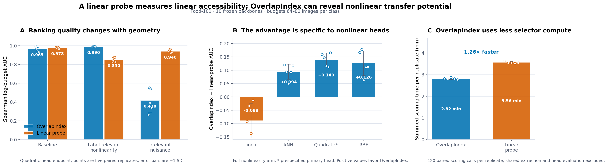
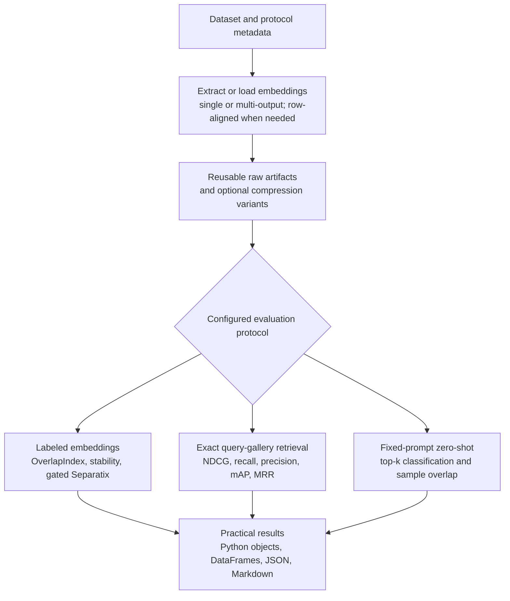
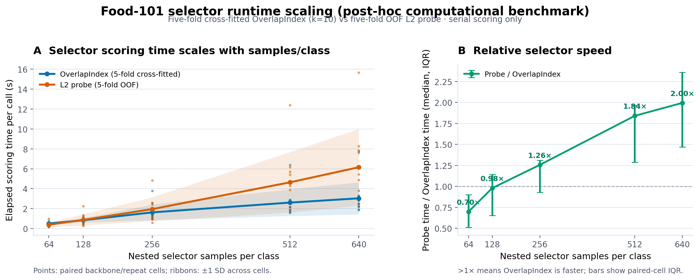
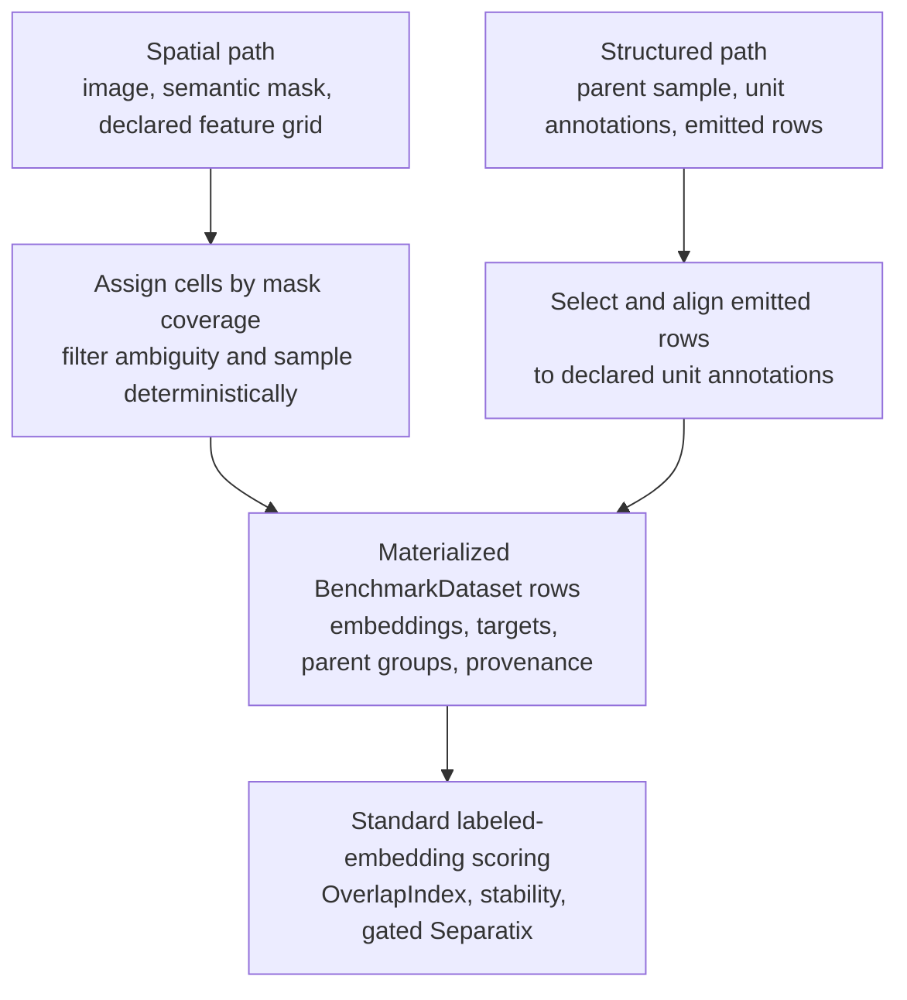

# Vertebrae

<p align="center">
  <a href="https://github.com/NiklasMelton/vertebrae">
    
  </a>
</p>

`vertebrae` helps answer a question that accuracy and loss leave open: **does a
model's representation organize the data around the distinctions you care about?**
It evaluates frozen embeddings separately from the choice, training, and tuning of a
downstream head. Use it to compare backbones, inspect intermediate layers, find weak
classes, audit nuisance structure, monitor training or distribution shift, and decide
whether compression preserved useful geometry.

## Why representation analysis?

A task metric evaluates the behavior of a complete system. Accuracy, F1, RMSE, and
cross-entropy are indispensable, but their values combine the representation with the
head, optimizer, training budget, regularization, thresholds, calibration, and data
split. Two embeddings can therefore produce similar task performance for very different
reasons, while a good representation can be hidden by a poorly chosen head.

[OverlapIndex](https://github.com/NiklasMelton/OverlapIndex) provides a complementary
view. For categorical targets, it summarizes how much the class-conditioned regions of
an embedding overlap. Scores lie in `[0, 1]`: `1.0` indicates perfect observed class
separation and `0.0` perfect observed class overlap. The global score makes controlled
extractor comparisons convenient, while per-class and pairwise results show where the
geometry succeeds or fails. Explicit regression targets use ContinuousOverlapIndex to
ask the analogous question about whether nearby representation regions preserve
continuous target structure.

This makes OverlapIndex useful for questions such as:

- Which backbone, layer, pooling strategy, or compression setting best preserves the
  target structure in this dataset?
- Is a failure concentrated in one class or pair of classes, or does it begin in an
  earlier layer of the backbone?
- Does the representation encode the intended target, a coarser hierarchy, or an
  undesirable shortcut such as source, color, or acquisition site?
- During training or deployment shift, does useful geometry degrade before the
  headline model metric moves?

## Why not just use a linear probe?

One common way to evaluate a pretrained backbone is to freeze it and train a linear
head on the target task. This is an inexpensive and useful baseline, but a weak linear
result only shows that the target structure was not readily accessible through that
linear decision rule and training protocol. It does not prove that the embedding lacks
useful separation.

That separation may follow curved, local, or multimodal boundaries. OverlapIndex helps
determine whether it exists without committing the evaluation to a particular
downstream head. When it does,
[Separatix](https://github.com/NiklasMelton/Separatix) provides evidence about whether
a linear model is likely sufficient or whether nonlinear approaches are worth testing.
Together, they help distinguish a poor representation from a promising representation
whose geometry is simply non-trivial.

The tools are complementary:

| Tool | Practical question |
| --- | --- |
| Linear probe | Can this representation be decoded by the linear head I trained? |
| OverlapIndex | Does the representation organize the labeled data into distinct regions? |
| Separatix | What level of downstream decision-boundary complexity is worth trying? |

The Food-101 example below shows why the distinction can matter. A linear probe and
OverlapIndex agree when target structure is readily linear. When useful structure is
nonlinear, OverlapIndex can recommend better backbones; when the geometry is dominated
by irrelevant nuisance structure, it can also be misled. The lesson is not that one
score always wins, but that a linear probe should not be treated as a complete audit of
the representation.



The practical workflow is to treat the two diagnostics as complementary:

| Diagnostic pattern | Practical interpretation |
| --- | --- |
| OverlapIndex high, probe high | Strong class organization that is also linearly accessible. |
| OverlapIndex high, probe lower | Nonlinear or multimodal transfer potential may be hidden from a linear decoder. |
| Probe high, OverlapIndex lower | A linear head works, but broader geometry may be fragmented or nuisance-sensitive. |
| Both low | The representation is a weak candidate for this target under the evaluated protocol. |

Use OverlapIndex to compare or shortlist representations before committing to a head.
Use a linear probe when linear-head behavior is the deployment objective. When the
scores disagree, inspect the geometry and validate a small set of appropriate head
families instead of assuming either score is universally correct.

> **Takeaway:** a linear probe evaluates one way of reading a representation;
> OverlapIndex evaluates how the labeled representation is organized.

Neither diagnostic replaces held-out downstream validation. See the
[scoring guide](docs/scoring.md) for configuration, interpretation, and detailed
experimental evidence.

### What OverlapIndex can and cannot tell you

OverlapIndex can show whether labels are reflected in the observed embedding geometry,
how that structure differs across classes and class pairs, and whether it is stable
across prototype seeds or controlled subsamples. With named target and hierarchy views,
the same embeddings can also reveal which of several possible concepts they organize.
These signals can help localize a representation problem, shortlist a transfer-learning
backbone, and avoid spending a full tuning budget on every candidate.

It does **not** measure end-to-end predictive performance, replace a held-out task
metric, or guarantee that a particular classifier will generalize. A high score does
not establish robustness, calibration, fairness, causality, or usefulness for an
unmeasured target. Scores are also conditional on the evaluated dataset, labels,
sampling, embedding normalization, and OverlapIndex configuration; compare candidates
under the same protocol rather than treating a score as a universal model rating.
Vertebrae deliberately reports representation diagnostics beside, not in place of,
task, retrieval, zero-shot, or domain-specific metrics.

## Why vertebrae?

OverlapIndex supplies the core representation signal; vertebrae turns it into a
repeatable evaluation workflow. It handles dense and sparse embeddings, raw inputs and
many extractor families, single- and multi-output models, classification, multi-label
and regression targets, named target and hierarchy views, structured units, dense
segmentation tokens, compression variants, stability analysis, caching, memory guards,
artifact-backed execution, and JSON/Markdown reports. The result is a practical way to
move from “this model scored well” to “this layer contains the right structure, these
classes remain weak, and this is the next downstream model family worth trying.”

The rest of this README follows that path: first run the core workflow, then compare
representations, and finally use the visual case studies to connect changing geometry
to training, compression, deployment shift, shortcuts, and task behavior.

## Evaluation flow

This separation of questions also shapes the package. The benchmark protocols share
extraction, artifact, compression, and reporting infrastructure while keeping their
scoring semantics separate.



## Installation

```bash
pip install vertebrae
```

For local development:

```bash
poetry install --with dev
```

Model families, modality adapters, visual suites, distributed backends, and cloud
stores are installed through optional extras. The
[installation guide](https://github.com/NiklasMelton/vertebrae/blob/develop/docs/installation.md)
contains the complete mapping.

## Quick start

### Precomputed embeddings

```python
from vertebrae import BenchmarkDataset, Evaluator, DatasetIdentity
from vertebrae.extractors import PrecomputedExtractor

dataset = BenchmarkDataset.from_embeddings(embeddings=Z, labels=y, identity=DatasetIdentity.declared("example-dataset", "1"))
extractor = PrecomputedExtractor(name="baseline_embeddings")

result = Evaluator(dataset=dataset, extractor=extractor).run()

print(result.to_dataframe())
result.save_json("result.json")
result.save_markdown("report.md")
```

That run gives you a global overlap score, detailed weak-class evidence, a stability
summary, and Separatix guidance about downstream classifier complexity when the overlap
gate passes.

Every root dataset requires an explicit `DatasetIdentity`. A declared identity is the
recommended production choice; change its revision whenever the dataset content,
ordering, targets, groups, or annotations change. Manifest identity hashes only a
caller-provided source manifest. Full content hashing and ephemeral UUID identity are
available only through the explicit `DatasetIdentity.from_content()` and
`DatasetIdentity.ephemeral()` constructors. Path-based datasets are never scanned or
hashed automatically. See [Dataset identity](https://github.com/NiklasMelton/vertebrae/blob/develop/docs/datasets.md#dataset-identity).

Sparse matrices are supported as embedding inputs as well.

By default, vertebrae also runs a Separatix complexity diagnostic when the
evaluated embedding reaches `overlap_macro >= 0.80`. That extra diagnostic does
not affect ranking. It adds report guidance about what kind of downstream
classifier complexity the labeled geometry appears to need.

Multi-label classification datasets are supported through the same constructors.
Use per-sample label sequences or a binary indicator matrix with `label_names`:

```python
from vertebrae import DatasetIdentity
dataset = BenchmarkDataset.from_embeddings(
    embeddings=Z,
    labels=[
        ("outdoor", "vehicle"),
        ("outdoor", "vehicle"),
        ("indoor",),
        ("indoor",),
        ("outdoor", "animal"),
        ("animal",),
    ],
    identity=DatasetIdentity.declared("example-dataset", "1"),
)

result = Evaluator(dataset=dataset, extractor=PrecomputedExtractor()).run()
```

OverlapIndex receives a sparse binary indicator target internally, and Separatix runs
with `target_mode="multilabel"`.

Regression targets are supported when explicitly requested so numeric class
identifiers are not accidentally interpreted as continuous targets:

```python
from vertebrae import DatasetIdentity
dataset = BenchmarkDataset.from_arrays(
    X=samples,
    y=targets,
    modality="tabular",
    target_type="regression",
    target_names=["quality_score"],
    identity=DatasetIdentity.declared("example-dataset", "1"),
)

result = Evaluator(dataset=dataset, extractor=extractor).run()
```

Regression scoring uses `ContinuousOverlapIndex` through vertebrae's internal
scoring adapter and appears in reports as continuous overlap diagnostics.

### Multiple target views

When one embedding should be compared against several aligned targets, register
named target views on the dataset and enable them in `Benchmark`. Views can be
classification, multi-label, or regression targets; each is reported as a
separate result variant.

```python
from vertebrae import Benchmark, BenchmarkDataset, TargetView, TargetViewConfig, DatasetIdentity

dataset = BenchmarkDataset.from_embeddings(embeddings=Z, labels=leaf_labels, identity=DatasetIdentity.declared("example-dataset", "1"))
dataset = dataset.with_target_views(
    [
        TargetView(name="coarse", targets=coarse_labels),
        TargetView(name="quality", targets=quality_scores, target_type="regression"),
    ]
)

result = Benchmark(
    dataset,
    [extractor],
    target_view_config=TargetViewConfig(enabled=True, views=("coarse", "quality")),
).run()
```

For taxonomies represented as label paths, use `with_label_hierarchy(...)` and
`LabelViewConfig` instead. `output_views` and `output_levels` can route named
extractor outputs to the target or hierarchy view that they should evaluate.

Classification labels keep exact typed semantic identity in the dataset and label
catalog. For example, integer `1` and string `"1"` are separate classes even though
their ordinary string forms match. Metric adapters receive marked semantic-key strings
in both local and artifact-backed runs, while results retain the original typed values,
stable internal keys, and disambiguated display text in the catalog. Hierarchy paths
are encoded structurally rather than by joining values with a delimiter.

### Optional embedding compression

```python
from vertebrae import BenchmarkDataset, EmbeddingCompressionConfig, Evaluator, DatasetIdentity
from vertebrae.extractors import PrecomputedExtractor

dataset = BenchmarkDataset.from_embeddings(embeddings=Z, labels=y, identity=DatasetIdentity.declared("example-dataset", "1"))
extractor = PrecomputedExtractor(name="baseline_embeddings")

compression = EmbeddingCompressionConfig(
    enabled=True,
    method="prefix_truncate",
    n_components=256,
    assume_matryoshka=True,
)

result = Evaluator(
    dataset=dataset,
    extractor=extractor,
    compression_config=compression,
).run()
```

Supported compression methods include `pca`, `incremental_pca`,
`truncated_svd`, random projections, `prefix_truncate`, and `quantize`.

The network-free-after-download
[`fashion_mnist_visual_suite.py`](https://github.com/NiklasMelton/vertebrae/blob/develop/examples/fashion_mnist_visual_suite.py)
also illustrates the storage-quality tradeoffs of PCA and quantization on a
trained penultimate embedding. Each point shows the measured OverlapIndex score
against encoded bytes per sample; the dashed line marks the non-dominated frontier.


### Scikit-learn pipelines

```python
from sklearn.decomposition import TruncatedSVD
from sklearn.feature_extraction.text import TfidfVectorizer
from sklearn.pipeline import Pipeline
from sklearn.preprocessing import Normalizer

from vertebrae import BenchmarkDataset, Evaluator, DatasetIdentity
from vertebrae.extractors import SklearnExtractor

pipeline = Pipeline(
    [
        ("tfidf", TfidfVectorizer(ngram_range=(1, 2), min_df=2)),
        ("svd", TruncatedSVD(n_components=128, random_state=42)),
        ("norm", Normalizer()),
    ]
)

dataset = BenchmarkDataset.from_arrays(texts, labels, modality="text", identity=DatasetIdentity.declared("example-dataset", "1"))
extractor = SklearnExtractor(
    name="tfidf_svd",
    pipeline=pipeline,
    # This manually versioned identity opts the fitted live pipeline into reuse.
    cache_identity="tfidf-svd-v1",
)

result = Evaluator(dataset=dataset, extractor=extractor).run()
```

### Local PyTorch models

```python
import numpy as np
import torch

from vertebrae import BenchmarkDataset, Evaluator, DatasetIdentity
from vertebrae.extractors import TorchExtractor

model = torch.load("/path/to/local_model.pt", map_location="cpu")
model.eval()


def collate_fn(batch):
    return torch.as_tensor(np.asarray(batch), dtype=torch.float32)


def output_fn(raw_output):
    return raw_output if isinstance(raw_output, torch.Tensor) else raw_output["embeddings"]


dataset = BenchmarkDataset.from_arrays(features, labels, modality="tabular", identity=DatasetIdentity.declared("example-dataset", "1"))
extractor = TorchExtractor(
    name="local_torch",
    model=model,
    collate_fn=collate_fn,
    output_fn=output_fn,
    device="cpu",
    checkpoint_paths=["/path/to/local_model.pt"],
    cache_identity="local-torch-model-v1",
    recipe_data={"checkpoint": "/path/to/local_model.pt"},
)

result = Evaluator(dataset=dataset, extractor=extractor).run()
```

Torch extraction defaults to evaluation plus inference mode and restores the model's
prior state afterward. `checkpoint_paths` contributes provenance, but an already-loaded
live object still needs a maintained `cache_identity` for reusable caching.

### Hugging Face vision and named outputs

One backbone may emit several named embeddings in a single evaluation. This is useful
for comparing intermediate and final layers without duplicating extractor classes:

```python
from vertebrae import Benchmark, CacheConfig
from vertebrae.extractors import HFVisionExtractor

benchmark = Benchmark(
    dataset,
    # The introductory remote model name below is intentionally unpinned.
    cache_config=CacheConfig(enabled=False),
)
benchmark.add_extractor(
    HFVisionExtractor(
        name="mnist_vit",
        model_id="farleyknight-org-username/vit-base-mnist",
        outputs=[
            {"name": "final_cls", "pooling": "cls"},
            {"name": "mid_cls", "pooling": "cls", "hidden_layer": 6},
        ],
        image_mode="rgb",
        batch_size=8,
    )
)

result = benchmark.run()
print(result.to_dataframe()[["extractor", "overlap_macro"]])
```

Each output is cached, compressed, scored, and reported independently. The
[complete extractor guide](https://github.com/NiklasMelton/vertebrae/blob/develop/docs/feature_extractors.md#hugging-face-adapters)
covers Hugging Face text, vision, audio, multimodal, time-series, and video adapters,
as well as Keras, ONNX, sentence-transformers, timm, torchvision, OpenCLIP/SigLIP,
TensorFlow Hub, JAX/Flax, tree, graph, and hosted embedding integrations.

### Multi-extractor comparison

```python
from vertebrae import Benchmark

benchmark = Benchmark(dataset)
benchmark.add_extractor(tfidf_extractor)
benchmark.add_extractor(sentence_transformer_extractor)
benchmark.add_extractor(custom_extractor)

result = benchmark.run()
print(result.to_dataframe())
```

Named outputs can also be routed to different target or hierarchy views. See
[`hf_vision_mnist.py`](https://github.com/NiklasMelton/vertebrae/blob/develop/examples/hf_vision_mnist.py)
for a complete layer comparison and
[`caltech101_vision_foundation_models.py`](https://github.com/NiklasMelton/vertebrae/blob/develop/examples/caltech101_vision_foundation_models.py)
for a more realistic DINOv2/ViT workflow.

## Practical diagnostic stories

The examples below show how representation geometry can guide practical decisions:
which layer to use, where a distribution shift first causes damage, whether a model
learned a shortcut, and which backbone or downstream head to try next. Full protocols
and result tables live in the linked guides and runnable scripts.

### Representation monitoring during training

`RepresentationMonitor` repeatedly runs a fresh labeled `Benchmark` against live
extractors while your code retains control of training, cadence, checkpoints, and
optimization. Named outputs make it possible to inspect representation separation as
a function of both training progress and layer depth.

```python
from vertebrae import (
    ConsoleReporter,
    EvaluationHistoryConfig,
    RepresentationMonitor,
)

monitor = RepresentationMonitor(
    fixed_probe_dataset,
    [live_torch_extractor],
    history_config=EvaluationHistoryConfig(
        storage="disk",
        path="representation-history.jsonl",
    ),
    reporters=[ConsoleReporter()],
)

for epoch in range(epochs):
    train_one_epoch(model)
    monitor.evaluate(epoch=epoch, metadata={"loss": training_loss})

history = monitor.history.to_dataframe()
```

Every call executes the configured benchmark stack and always recomputes embeddings,
even if an enabled cache is supplied. Use a fixed held-out probe dataset and control
evaluation cost through cadence, stability, and Separatix settings. The append-only
JSONL format supports protocol-validated resume and read-only loading. Restoring the
matching live model, optimizer, epoch, and step remains the caller's responsibility.
See the
[representation monitoring guide](https://github.com/NiklasMelton/vertebrae/blob/develop/docs/monitoring.md) and the network-free
`examples/representation_monitoring.py` Torch workflow.

The network-free-after-download
[`fashion_mnist_visual_suite.py`](https://github.com/NiklasMelton/vertebrae/blob/develop/examples/fashion_mnist_visual_suite.py)
trains a compact two-block convolutional network and applies the same protocol
to real Fashion-MNIST evaluations. It carves a fixed, stratified validation set
out before training, leaves the official test set untouched, and disables
Separatix and stability repeats so each figure focuses on the raw OverlapIndex
diagnostic. For complementary visual examples of the underlying metrics, see the
[OverlapIndex](https://github.com/NiklasMelton/OverlapIndex) and
[Separatix](https://github.com/NiklasMelton/Separatix) repositories.

#### Watch a representation take shape

[`fashion_mnist_embedding_animation.py`](https://github.com/NiklasMelton/vertebrae/blob/develop/examples/fashion_mnist_embedding_animation.py)
trains a Fashion-MNIST classifier through a true two-dimensional bottleneck. The
points in the animation are the exact features consumed by the linear head—not a
PCA or UMAP projection—so the figure shows class geometry and validation accuracy
developing together on the same fixed, held-out examples.

The display aligns successive checkpoints to avoid distracting rotations without
changing the classifier's decisions. Frames labeled **Display interpolation** only
smooth the animation and are not trained model states; the accompanying CSV retains
the raw checkpoint metrics. In the checked-in run, the final bottleneck reaches raw
OverlapIndex `0.793` and `89.8%` validation accuracy. Those values illustrate one
run rather than a general performance claim.


```bash
poetry install -E visuals
poetry run python examples/fashion_mnist_embedding_animation.py
```

#### Representation trajectories

Two spatial convolutional representations and the learned 128-dimensional embedding
are evaluated before training and every two optimizer steps over three epochs. The same
layer identities and colors connect the network diagram to the monitoring curves.
Fashion-MNIST's visually related apparel classes make it possible to compare how local
features and the task-specific embedding evolve at different depths.


#### Corruption and deployment-shift atlas

The companion
[`fashion_mnist_corruption_atlas.py`](https://github.com/NiklasMelton/vertebrae/blob/develop/examples/fashion_mnist_corruption_atlas.py)
reuses the saved trained checkpoint and turns the untouched official test split into a
model-release probe. It evaluates clean images plus blur, Gaussian noise, occlusion,
contrast reduction, and rotation at four increasing severities without training another
model. A fixed `k=5` makes OverlapIndex retention comparable across conditions within
each layer.

The atlas asks **what failed, where did it start, and who was affected?** It places
within-layer OI retention beside accuracy and cross-entropy, then drills into affected
classes and the first new pairwise confusions. Retention is contextual evidence, not a
claim that classifier behavior improved.


The run finds three distinct stories. Severe noise retains `0.89` of clean embedding
OI with accuracy `0.733`. Severe contrast damages the backbone: first- and second-block
retention fall to `0.11` and `0.37`, with accuracy `0.299`. Rotation preserves early
features but damages the task representation: block 2 retains `0.92`, the embedding
retains `0.73`, and accuracy falls to `0.407`. Those patterns suggest different fixes,
from preprocessing/backbone work for contrast to later-block fine-tuning for rotation.
The [monitoring guide](https://github.com/NiklasMelton/vertebrae/blob/develop/docs/monitoring.md#corruption-and-deployment-shift-atlas)
retains the complete interpretation table, pair findings, production checklist, and
comparison caveats.

#### Paired overfitting monitor

The companion
[`fashion_mnist_overfitting.py`](https://github.com/NiklasMelton/vertebrae/blob/develop/examples/fashion_mnist_overfitting.py)
trains clean-label and noisy-label CNNs from identical weights with identical images,
mini-batch order, optimizer settings, and schedules. Forty percent of a 1,000-example
training subset receives a deterministic wrong label. The models are then compared on
the same clean validation and corrupted-target probes, while held-out loss defines the
shaded overfitting region independently of OI.

The important story begins after the noisy model reaches its best validation loss.
From epochs 10 to 20, its final-embedding OI on the corrupted targets rises from `0.039`
to `0.313`, while the clean control remains near zero on those arbitrary labels. At the
same time, the noisy model's clean-probe OI stalls near `0.63`, while the control
continues from `0.669` to `0.718`. The noisy model is not merely fitting the wrong
answers at its output. Its late representation is increasingly reorganizing around
those answers while making no further progress on transferable garment structure.

The layer comparison localizes that tradeoff. Early features remain similar, the
second block begins to diverge, and the strongest arbitrary-target geometry appears in
the final embedding. For a practitioner, that pattern argues against discarding the
entire backbone. It points instead toward restoring an earlier checkpoint, preserving
the reusable early features, auditing the corrupted labels, and focusing regularized or
noise-robust retraining on the later representation stages.


OI is not an overfitting detector by itself. Held-out loss establishes the failure;
OverlapIndex reveals what geometry the model learned and where that learning entered
the representation hierarchy. The
[full monitoring case study](https://github.com/NiklasMelton/vertebrae/blob/develop/docs/monitoring.md#paired-overfitting-monitor)
preserves the control design, interpretation table, and practical response patterns.

#### Demonstrated use case: auditing shortcut learning with named target views

A model can look excellent on its headline metric while organizing its representation
around the wrong semantics. The
[`colored_fashion_mnist_shortcut.py`](https://github.com/NiklasMelton/vertebrae/blob/develop/examples/colored_fashion_mnist_shortcut.py)
experiment demonstrates how named target views, a controlled reference run, and an
external behavioral intervention can expose that failure mode.

The practical question is deliberately simple: if garment color predicts garment class
during training, does a CNN learn the garment or the color shortcut? Accuracy alone
cannot answer this on the training distribution. Likewise, high class OI alone cannot
answer it if class and color are correlated in the representation probe. The experiment
therefore separates three jobs:

1. A paired control isolates the effect of the class-color correlation.
2. A decorrelated audit probe asks what each layer organizes.
3. Counterfactual recoloring asks whether the learned organization changes behavior.

##### Experimental design

Two identically initialized CNNs receive the same 2,000 garments, targets, batches, and
12-epoch schedule. Color is useless in the control but predicts class 85% of the time in
the treatment. A held-out 2,000-garment probe is rendered grayscale, canonical,
independently colored, and with a reversed mapping.


The representation audit balances class×color cells and registers two views:

- `intended_class`: the garment category that the classifier should learn;
- `nuisance_color`: the tint that should not determine the prediction.

Balancing keeps garment and color statistically independent so the views describe
distinct geometry. Five paired seeds measure variation across trained models.

##### What the ordinary evaluation would conclude

The treatment appears better in-distribution at `91.42%` versus `82.63%`, but trails the
control by 13.81 points on balanced colors and 35.54 points under reversal.


##### What named target views reveal

At epoch 12, the control's final embedding reaches intended-class OI `0.675`, versus
`0.557` for the treatment. In block 2, nuisance-color OI is `0.009` for the control and
`0.194` for the treatment. The paired effect localizes shortcut structure before the
classifier head.


Final-embedding color OI can remain low while predictions are color-sensitive: a
classifier may exploit a weak or class-conditional direction without producing ten
globally separated color clusters. OI localizes geometry; counterfactual accuracy tests
whether the nuisance affects decisions.

##### Exhaustive recoloring confirms the harm

Across all ten recolorings, treatment accuracy falls to `68.28%` versus `82.70%` for
the control. **Prediction changes under recoloring** rise from `3.42%` to `62.17%`, and
the treatment's 10th-percentile class×color accuracy is only `6.75%`. Aggregate
in-distribution accuracy had hidden nearly unusable garment-color cells.

##### How to apply this pattern

The transferable pattern is to name intended and nuisance targets, decorrelate them on
a fixed probe, compare with a controlled reference, monitor the same layers, intervene
on the nuisance, and repeat paired training seeds. The
[full shortcut case study](https://github.com/NiklasMelton/vertebrae/blob/develop/docs/monitoring.md#shortcut-learning-with-named-target-views)
retains the complete result tables, audit checklist, caveats, and reproduction command.

#### Hierarchical label views

The same representations are evaluated against nested department, garment-group, and
exact-class label views before and after training.


#### Tiny Shakespeare transformer representations

[`tiny_shakespeare_transformer_visual_suite.py`](https://github.com/NiklasMelton/vertebrae/blob/develop/examples/tiny_shakespeare_transformer_visual_suite.py)
extends the same monitoring pattern to a character GPT. It tracks named hidden states
against a fixed next-character probe while language-model loss and accuracy remain
separate behavioral measures. In the checked 5,000-step run, validation cross-entropy
falls from `4.1555` to `1.6097` while final-block macro OverlapIndex rises from `0.173`
to `0.351`, localizing most of the learned target geometry to the transformer blocks.


The [monitoring guide](docs/monitoring.md#hierarchical-fashion-mnist-and-tiny-shakespeare)
contains the full data split, support rules, compression results, and reproduction
profiles.

Reproduce these monitoring examples with:

```bash
poetry install -E visuals
poetry run python examples/fashion_mnist_visual_suite.py
poetry run python examples/fashion_mnist_embedding_animation.py
poetry run python examples/fashion_mnist_corruption_atlas.py
poetry run python examples/fashion_mnist_overfitting.py
poetry run python examples/colored_fashion_mnist_shortcut.py --repeats 5
poetry run python examples/tiny_shakespeare_transformer_visual_suite.py
```

### Choosing backbones and downstream heads

[`oxford_pets_backbone_selection.py`](https://github.com/NiklasMelton/vertebrae/blob/develop/examples/oxford_pets_backbone_selection.py)
shows the two decisions separately: use OverlapIndex to shortlist frozen backbone
outputs, then use Separatix to decide which downstream family is worth testing. On
Oxford-IIIT Pet, the representation ranking tracks held-out transfer quality while the
head guidance distinguishes genuinely nonlinear structure from a relationship that can
be made linear with better features.


The second plot shows the practical payoff: exposing difference and product features
can turn an apparently nonlinear comparison into one that a simple linear head handles
well. Try a clearer task representation before automatically paying for a larger head.


```bash
poetry install -E backbone-selection
poetry run python examples/oxford_pets_backbone_selection.py
```

#### Food-101: when nonlinear geometry matters

[`food101_nonlinear_backbone_bridge.py`](https://github.com/NiklasMelton/vertebrae/blob/develop/examples/food101_nonlinear_backbone_bridge.py) is
the runnable example behind the opening story. It compares a linear probe with
OverlapIndex while fixed linear, quadratic, kNN, and RBF heads provide independent
downstream checks. The useful pattern is simple: the methods agree on easy linear
geometry, but OverlapIndex is better able to surface useful nonlinear organization.
The nuisance control is a reminder to validate the shortlisted model on the real task.

See the [scoring guide](docs/scoring.md#food-101-nonlinear-backbone-experiment-q1-confirmatory-protocol)
for the full methodology and results.

```bash
poetry install -E backbone-selection
poetry run python examples/food101_nonlinear_backbone_bridge.py
poetry run python examples/plot_food101_overlap_vs_linear_probe_story.py
```

#### Selector cost as the dataset grows

[`food101_selector_runtime_scaling.py`](https://github.com/NiklasMelton/vertebrae/blob/develop/examples/food101_selector_runtime_scaling.py)
compares the cost of scoring the same frozen embeddings. A linear probe is faster on
the smallest panel; OverlapIndex catches up as the dataset grows and reaches a **2×
median speedup at 25,600 embeddings** in this Food-101 run.



The crossover depends on hardware, feature dimension, class count, and implementation,
so benchmark on your own embeddings when runtime matters. The script and tracked
[summary](https://github.com/NiklasMelton/vertebrae/blob/develop/examples/assets/food101_selector_runtime_scaling_summary.json) make that easy.

```bash
poetry run python examples/food101_selector_runtime_scaling.py --output-dir examples/output
poetry run python examples/plot_food101_selector_runtime_scaling.py
```

## Other evaluation protocols

### Retrieval and matching

`RetrievalBenchmark` evaluates frozen query embeddings against an explicit gallery
and graded relevance judgments. It is an exact, training-free ranking protocol and
is separate from ordinary labeled OverlapIndex benchmarking.

```python
from vertebrae import RetrievalBenchmark, RetrievalConfig, RetrievalDataset, DatasetIdentity
from vertebrae.extractors import PrecomputedExtractor

dataset = RetrievalDataset.from_embeddings(
    query_embeddings,
    gallery_embeddings,
    relevance=[("query-1", "document-9", 2.0)],
    query_ids=["query-1"],
    gallery_ids=["document-9"],
    identity=DatasetIdentity.declared("example-dataset", "1"),
)

result = RetrievalBenchmark(
    dataset,
    [PrecomputedExtractor("candidate")],
    retrieval_config=RetrievalConfig(primary_metric="ndcg@10"),
).run()
```

Relevance can be a NumPy/scipy query-by-gallery matrix or sparse
`(query_id, gallery_id, grade)` records. Nested Python lists are records; construct
nested-list matrices explicitly with `RetrievalDataset.from_relevance_matrix(...)`.
Every query must retain an eligible positive after exclusions. Reports include NDCG, precision, recall,
hit rate, MRR, mAP, and similarity diagnostics. See
[the retrieval guide](https://github.com/NiklasMelton/vertebrae/blob/develop/docs/retrieval.md) for branch-aware extractors,
bidirectional scoring, exclusions, compression, and artifact workflows.

### Fixed-prompt zero-shot alignment

For contrastive extractors with independently encodable sample and text branches,
`ZeroShotBenchmark` evaluates whether fixed class prompts address the dataset in the
model's shared embedding space. It trains no head and requires explicit prompts. The
zero-shot rank and ordinary sample-embedding overlap are reported side by side; they
are not combined into a universal backbone score. See `docs/zero_shot.md` and the
network-free `examples/zero_shot_callable.py` workflow.

#### Flagship example: zero-shot versus transfer structure

The OpenCLIP CIFAR-10 experiment in
`examples/zero_shot_transfer_structure.py` separates sample structure from text
alignment. It encodes a balanced set of 500 images exactly once with the frozen
OpenCLIP image encoder, producing one fixed image-embedding matrix. OverlapIndex is
then calculated once from that matrix and the CIFAR-10 labels.

The same image matrix is reused with three explicit prompt protocols. Only the text
changes: `cat`, `a photo of a cat`, or
`a low-resolution CIFAR-10 image of a cat`, for example. Each string passes
through the same frozen text encoder and produces a different class prototype. Model
weights, image embeddings, and the shared embedding space remain unchanged; only the
prototype locations used for cosine-similarity classification move.


The left panel shows the central result. The sample representation has a fixed macro
OverlapIndex of `0.892`, while zero-shot accuracy changes from `73.2%` with bare labels
to `93.8%` with photo prompts, a `20.6` percentage-point improvement without changing
the image representation. Weak initial zero-shot accuracy therefore did not imply weak
transfer features in this run; the original text prototypes addressed otherwise strong
image structure poorly.

The right panel shows the same distinction per class. Rows are ordered by their fixed
per-class OverlapIndex. Colored markers are zero-shot F1 under each prompt protocol,
the gray segment is the prompt-driven F1 range, and the percentage-point annotation
quantifies prompt sensitivity. `automobile`, for example, has strong structure
(`OI: 0.96`) but an `87`-point F1 range across prompts. Per-class OverlapIndex and F1
should not be compared as interchangeable values: they answer different questions
despite both being bounded scores.

For practitioners, the two signals suggest different next actions:

| sample structure | zero-shot alignment | practical next step |
| --- | --- | --- |
| strong | weak or prompt-sensitive | Keep the backbone; improve class wording, use a predeclared prompt ensemble, or train a supervised head. |
| strong | strong and stable | The frozen representation is both transferable and naturally text-addressable for this protocol. |
| weak | strong | Zero-shot classification works, but inspect whether the feature geometry is robust enough for broader transfer. |
| weak | weak | Investigate another backbone, domain adaptation, or a different data representation. |

Prompt alternatives should be declared before evaluation or chosen on a separate
validation set. Trying many prompts against test labels and reporting only the winner
turns prompt design into test-set tuning. The experiment is intentionally diagnostic:
it does not combine OverlapIndex and zero-shot accuracy into one model-quality score.

Use `ZeroShotCandidate(extractor, sample_branch, text_branch)` when compared models
use different branch names. OpenCLIP keeps its image-only ordinary default while its
native `text_branch` remains available for zero-shot. Callable adapters cache only
when their functions have portable paths or an explicit `cache_identity`.

Retrieval and zero-shot compression keep both sides in one representation space.
Learned retrieval transforms are fitted on the gallery and applied to queries;
learned zero-shot transforms are fitted on samples and applied to prompt embeddings.
The CLI exposes these paired workflows through `compress-retrieval` and
`compress-zero-shot`.

### Custom embedding metrics

Every benchmark always records the built-in overlap metric. You can score the
same full embedding batch with additional metrics and choose one as the ranking
criterion. A custom metric returns a finite aggregate `score` and may include
JSON-safe diagnostics, warnings, and metadata.

For protocol parity, categorical labels and groups passed to custom metrics are
marked semantic-key strings locally and on distributed workers; regression targets
remain numeric. Read original typed provenance and display values from
`target_metadata["label_catalog"]` when needed.

```python
from vertebrae import Benchmark, CallableMetric

def domain_margin(embeddings, labels, *, groups=None, seed=None):
    return {"score": 0.87, "diagnostics": {"rule": "domain margin"}}

result = Benchmark(
    dataset,
    [extractor],
    metrics=[CallableMetric("domain_margin", domain_margin)],
    primary_metric="domain_margin",
).run()
```

The overlap result remains available in every `ExtractorResult` and continues
to drive stability and Separatix. For artifact or CLI workflows, use an
importable callable path such as `my_project.metrics:domain_margin`; see
[the scoring guide](https://github.com/NiklasMelton/vertebrae/blob/develop/docs/scoring.md)
and [the distributed-readiness guide](https://github.com/NiklasMelton/vertebrae/blob/develop/docs/distributed_readiness.md).

### Dense segmentation tokens

Dense segmentation evaluation scores spatial feature cells after they are aligned
to semantic mask labels. It measures representation organization for retained
tokens; it is not an IoU, mask-accuracy, or boundary-quality metric.

Both dense spatial outputs and other structured model outputs become ordinary
labeled embedding rows before scoring:



```python
from vertebrae import (
    Benchmark,
    CallableSpatialExtractor,
    SegmentationConfig,
    SegmentationDataset,
    SpatialLayout,
    SpatialOutputSpec,
)

dataset = SegmentationDataset.from_arrays(
    images=images,
    semantic_masks=masks,
    identity=DatasetIdentity.declared("example-dataset", "1"),
)

extractor = CallableSpatialExtractor(
    "encoder",
    transform_fn=extract_spatial_features,
    output_specs=[
        SpatialOutputSpec(
            name="stage_4",
            layout=SpatialLayout(grid_height=14, grid_width=14),
        )
    ],
)

result = Benchmark(
    dataset=dataset,
    extractors=[extractor],
    segmentation_config=SegmentationConfig(max_tokens_per_class=10_000),
).run()
```

See `docs/segmentation.md` for background handling, ambiguity filtering,
instance caps, grouped diagnostics, and precomputed segmentation embeddings.

### Structured units from native model outputs

Structured extractors flatten one declared per-parent unit matrix into a grouped
embedding dataset, preserving unit provenance and parent groups. This supports
representation diagnostics for regions, tokens, frames, keypoints, depth cells,
and latent slots. It does not substitute task-native metrics such as mAP, IoU,
WER/CER, OKS, depth error, or reconstruction quality.

Unit annotations may use single-label, multi-label, or one-/multi-target
regression targets, provided every parent uses the same resolved schema. Local
unit IDs may repeat across parents; materialization generates parent-aware
global IDs and retains the supplied value as `local_unit_id` in provenance.
Dense and scipy sparse per-parent matrices are supported without premature
densification.

```python
from vertebrae import Benchmark, BenchmarkDataset, UnitAnnotation, DatasetIdentity
from vertebrae.extractors import CallableStructuredExtractor, StructuredOutputSpec

dataset = BenchmarkDataset.from_arrays(X=pages, y=document_labels, modality="image", identity=DatasetIdentity.declared("example-dataset", "1"))
dataset = dataset.with_unit_annotations(
    [
        UnitAnnotation(labels=["heading", "body"]),
        UnitAnnotation(labels=["heading", "body"]),
    ],
    unit_type="document_region",
)

extractor = CallableStructuredExtractor(
    name="layout_encoder",
    transform_fn=extract_region_embeddings,  # one 2D matrix per page
    output_specs=[StructuredOutputSpec(name="regions", unit_type="document_region")],
)
result = Benchmark(dataset, [extractor]).run()
```

When the model emits unmatched rows (for example special tokens or sampled
frames), supply an explicit alignment rule such as
`drop_special_rows(leading=1)` or `select_frame_rows(...)`. Typed adapters are
also available for detection/layout, sequence labeling, keypoints, depth, and
latent slots. See
[the dataset guide](https://github.com/NiklasMelton/vertebrae/blob/develop/docs/datasets.md)
and [the extractor guide](https://github.com/NiklasMelton/vertebrae/blob/develop/docs/feature_extractors.md),
alongside the runnable
`examples/structured_*.py` workflows.

## Supported Workflows

The package covers labeled classification, multi-label, regression, named target and
hierarchy views, structured units, dense segmentation, exact retrieval, fixed-prompt
zero-shot alignment, monitoring, compression, custom metrics, local/distributed
execution, and local/S3/GCS artifacts. SciPy sparse matrices and arrays remain sparse
through classification, multi-label, regression, and stability scoring, and at the
vertebrae boundary when passed into Separatix; multi-label targets may also be sparse
binary indicators. The
[complete workflow inventory](https://github.com/NiklasMelton/vertebrae/blob/develop/docs/workflows.md)
groups every supported dataset, extractor, protocol, report, and CLI stage. The
[distributed guide](https://github.com/NiklasMelton/vertebrae/blob/develop/docs/distributed_readiness.md)
documents trusted pickle inputs, cache identity, immutable manifests, streaming
contracts, Ray/Dask/SLURM execution, and cloud-store requirements.

## Reports and Results

Resource profiling can be enabled when deployment cost is part of representation
selection:

```python
from vertebrae import ResourceProfilingConfig

result = Benchmark(
    dataset,
    extractors=[small_backbone, large_backbone],
    resource_profiling_config=ResourceProfilingConfig(enabled=True),
).run()

print(result.to_dataframe())
print([item.name for item in result.quality_cohort()])
```

The profile observes the benchmark's real local extraction calls. It reports
first-call and warm latency, observed throughput, host memory, supported device/model
footprints, and logical raw/compressed embedding storage. It does not change quality
ranking. A cache hit remains a cache hit and reports inference as unmeasured; use
`CacheConfig(force_recompute=True)` when a fresh inference measurement is required.

Profiles distinguish complete, partial, unavailable, and CPU-not-applicable evidence.
Latency remains meaningful only with its batch, device, precision, synchronization, and
cache context; it is a workload observation rather than a hardware-normalized score.
The results guide documents native device adapters and distributed endpoint profiles.

Each benchmark run returns structured results that include:

- dataset summary,
- extractor summary and recipe metadata,
- overlap scores plus per-class, per-label, or per-target diagnostics,
- Separatix recommendation, confidence, and report details when the overlap gate passes,
- label-view, target-view, segmentation, structured-unit, grouping, and target-type
  metadata when present,
- every configured metric result and the selected primary ranking metric,
- compression metadata and compressed dimensions,
- stability summaries,
- warnings and recommendations,
- reproducibility metadata.

Only results whose selected metric declares `aggregate_valid=True` participate in
rankings, quality cohorts, top recommendations, or resource comparisons. When no
valid aggregate remains, reports say that ranking is unavailable instead of promoting
an invalid result.

Results can be rendered directly to Markdown or JSON:

```python
result.save_json("result.json")
result.save_markdown("report.md")
```

You can also convert rankings into a DataFrame with `result.to_dataframe()`.

Compression-aware results include the compression method and compressed
dimension, and quantized runs preserve calibration metadata in the structured
result payload.

Separatix is stored as the default classifier-complexity report field. JSON
output preserves the full Separatix report. Markdown and DataFrame views
surface the main recommendation, confidence, and compact explanation fields
that are usually the most actionable.

Separatix `0.1.1` adds an uncertainty-aware family frontier to those summaries.
`SeparatixResult.family_guidance` reports the minimum recommended family,
plausible alternatives, the decision method, selected family/probe and recipe id,
MLP-override status, and paired-comparison status/method. The normalized probe
evaluation context records estimator alignment, the CV/cohort plan, and effective
train size. Use `SeparatixResult.probe_recipe(...)` or
`selected_probe_recipe()` with Separatix's `make_probe_estimator(...)` factory to
reproduce the exact diagnostic estimator. A missing recipe is reported as
unavailable rather than replaced with a hand-built approximation.
When MLP probes are enabled, their compute trigger is separate from the paired
improvement required to override a simpler family; an untriggered MLP is therefore
not evidence that linear guidance won an exhaustive comparison.

Separatix is also the source of probe-style summary fields, so vertebrae does not
fit a second probe system alongside the complexity diagnostic.

The key component of the report is the performance and comparison table. The
following is the current output generated by
`examples/sklearn_wine_pipeline.py`.

| rank | extractor | primary_metric | primary_score | overlap_macro | stability_interval | weakest_class | best_probe | probe_metric | probe_score | embedding_dim | recommendation |
| --- | --- | --- | ---: | ---: | --- | --- | --- | --- | ---: | ---: | --- |
| 1 | wine_standard_scaler_all_features | overlap | 0.9232 | 0.9232 | 0.9058-0.9279 | class_1 | linear | balanced_accuracy | 0.9812 | 13 | strong_candidate |
| 2 | wine_standard_scaler_pca_6 | overlap | 0.9179 | 0.9179 | 0.9051-0.9368 | class_1 | kernel_approx | balanced_accuracy | 0.9767 | 6 | strong_candidate |
| 3 | wine_minmax_pca_2 | overlap | 0.9079 | 0.9079 | 0.9366-0.9455 | class_1 | smooth_poly | balanced_accuracy | 0.9756 | 2 | strong_candidate |
| 4 | wine_quantile_pca_1 | overlap | 0.4554 | 0.4554 | 0.3455-0.4554 | class_2 |  |  |  | 1 | poor_frozen_representation_weak_class_attention |

The full generated table also includes `target_view`, `label_view`,
`overlap_score`, `overlap_weighted`, compression fields, and Separatix fields.
The compact table above keeps the README readable while preserving the values used
for the ranking. Its `recommendation` column is Vertebrae's representation-quality
summary; the separate `separatix_recommendation` column uses the eight canonical
Separatix labels described below.

By default, extractors are ranked by overlap. When a custom `primary_metric` is
configured, they are ranked by that metric instead; the overlap columns remain
available for representation diagnostics and Separatix gating.

For classification and multi-label targets, discrete OverlapIndex scores are
bounded to `[0, 1]`: `1.0` indicates perfect class separation and `0.0` indicates
perfect class overlap. The discrete score is not permutation-null calibrated, so
`0.5` has no special null interpretation. ContinuousOverlapIndex uses the separate
regression calibration described in the scoring documentation.

The easiest way to interpret the report is:

- Start with `primary_metric` and `primary_score`. By default these are overlap;
  with a custom metric they identify the configured ranking signal.
- Inspect `overlap_macro` and per-class overlap scores as the standard vertebrae
  representation diagnostic, even when another metric ranks the candidates.
- Use the vertebrae `recommendation` field as a quick summary of representation quality under the benchmark protocol.
- Use `separatix_recommendation` and `separatix_confidence` to understand what kind of downstream classifier complexity the labeled embedding seems to imply once the representation is already reasonably separated. The recommendation uses exactly eight canonical labels shared across target modes: `linear_likely_sufficient`, `smooth_nonlinear_recommended`, `kernel_or_local_recommended`, `high_capacity_or_partitioning_recommended`, `feedforward_mlp_recommended`, `feature_or_target_bottleneck_likely`, `insufficient_data_or_unreliable_geometry`, and `inconclusive`.
- When Separatix columns are blank, the diagnostic was disabled, did not clear the
  overlap gate, or did not return that field. Check the per-extractor skip reason
  before interpreting the blank.
- Treat `best_probe`, `probe_metric`, and `probe_score` as Separatix-derived
  quick-check columns. They are blank when Separatix is disabled, skipped, or does
  not report a baseline probe score. The metric is target-aware rather than always
  being accuracy.
- Use the family frontier to plan downstream experiments: start with
  `minimum_recommended_family`, retain `plausible_families` as unresolved
  alternatives, and inspect paired evidence and effective train size before
  calling a recommendation a mismatch. The shared machine-readable label does
  not remove target-specific regression prose or confidence handling.

Problem classes change the interpretation and detail columns, not the overall report
workflow:

| problem class | target metadata | detailed overlap output | typical probe metric |
| --- | --- | --- | --- |
| single-label classification | class names and counts | per-class and pairwise scores | balanced accuracy |
| multi-label classification | label names, cardinality, and density | per-label scores | macro/micro F1 or sample Jaccard |
| regression | target names and target statistics | per-target continuous overlap | R² or a regression-specific metric |
| hierarchy or named target views | active view and available views | one ranked result per evaluated view | follows the projected target type |
| dense segmentation | source-image groups and token provenance | per-class token overlap | classification metric when applicable |

See [results and reports](https://github.com/NiklasMelton/vertebrae/blob/develop/docs/results_and_reports.md) for the complete schema and
the additional metadata retained for multi-output, structured, relational, and
zero-shot workflows.

In the per-extractor Markdown section, Separatix also adds:

- a plain-language recommendation text,
- a decision path showing the main diagnostic branches,
- normalized summary scores such as signal, overlap, linearity, nonlinearity, and reliability,
- family guidance (minimum family, plausible alternatives, selected probe/recipe,
  and paired-comparison status),
- evaluation alignment, CV/cohort size, and effective train-size context,
- warnings and skipped diagnostics when part of the complexity audit did not run.

As a rule of thumb, a strong overlap score plus `linear_likely_sufficient`
usually points to an embedding that should work well with simple downstream
classifiers, while a strong overlap score plus
`smooth_nonlinear_recommended` or `kernel_or_local_recommended` suggests the
embedding is promising but may benefit from a more flexible decision boundary.

## Documentation

| Topic | Guide |
| --- | --- |
| Installation and optional extras | [Installation](https://github.com/NiklasMelton/vertebrae/blob/develop/docs/installation.md) |
| Complete capability inventory | [Workflows](https://github.com/NiklasMelton/vertebrae/blob/develop/docs/workflows.md) |
| Dataset constructors, targets, hierarchy, and alignment | [Datasets](https://github.com/NiklasMelton/vertebrae/blob/develop/docs/datasets.md) |
| Local, Hugging Face, and optional model adapters | [Feature extractors](https://github.com/NiklasMelton/vertebrae/blob/develop/docs/feature_extractors.md) |
| Overlap, custom metrics, stability, and Separatix | [Scoring](https://github.com/NiklasMelton/vertebrae/blob/develop/docs/scoring.md) |
| Monitoring and complete case-study protocols | [Representation monitoring](https://github.com/NiklasMelton/vertebrae/blob/develop/docs/monitoring.md) |
| Compression choices and storage-quality tradeoffs | [Compression](https://github.com/NiklasMelton/vertebrae/blob/develop/docs/compression.md) |
| Result objects, tables, JSON, Markdown, and resources | [Results and reports](https://github.com/NiklasMelton/vertebrae/blob/develop/docs/results_and_reports.md) |
| CLI, caching, artifacts, Ray, Dask, SLURM, S3, and GCS | [Distributed readiness](https://github.com/NiklasMelton/vertebrae/blob/develop/docs/distributed_readiness.md) |
| Runnable scripts | [Examples](https://github.com/NiklasMelton/vertebrae/blob/develop/examples/README.md) |

The package targets Python `>=3.9,<3.15`. Run `vertebrae --help` for the CLI command
surface and use the generated API reference for symbol-level details.

## License

The source code is licensed under the GNU Affero General Public License
v3.0 or later (AGPLv3-or-later). Commercial licenses are available; please
contact the maintainer through GitHub.
